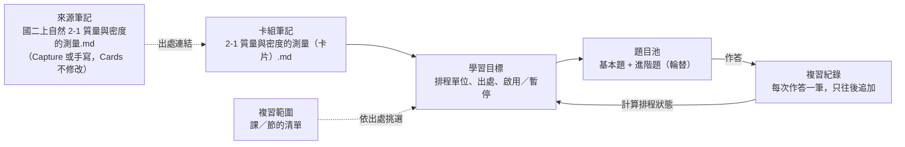
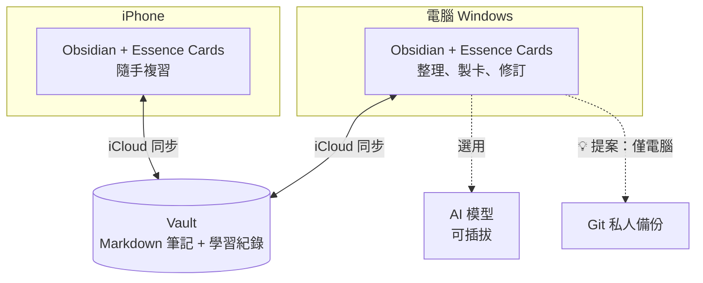

# Essence Cards｜架構

更新：2026-10-10｜狀態：架構釐清七步已完成；出題語法在寫程式前定稿（見[路線圖](roadmap.md#v1-開發前要做的事)）

這份文件回答「技術上怎麼組成」。為什麼做、做到什麼程度見[產品定義](product.md)。

狀態標示：✅ 已確認｜🔁 舊共識，待重新確認｜💬 待討論｜💡 助理提案

## 1. 術語表

| 名詞 | 定義 | 狀態 |
|---|---|---|
| Source（來源） | 課本、PDF、網頁、影片等原始材料 | ✅ |
| Note（筆記） | Obsidian 裡的一篇 Markdown，是人閱讀的單位 | ✅ |
| Knowledge Item（知識項目） | 最小的「有意義知識單位」 | ✅ |
| Learning Target（學習目標） | 最小的「可獨立判斷學生會不會的學習目標」；排程的單位 | ✅ |
| Prompt（題目） | 為了檢核某個學習目標，呈現給學生的一次具體刺激；同一目標可以有多種問法 | ✅ |
| Card（卡片） | 目前主要的題目呈現方式：提示 → 想答案 → 翻面 → 自評 | ✅ |
| Review Event（複習紀錄） | 一次作答的結果；格式見 [§5](#複習紀錄d-035) | ✅ |
| Scheduler（排程器） | 依複習紀錄決定下次出現時間；可以替換；v1 用 FSRS（D-043） | ✅ |
| Review Debt（複習債務） | 每個學習目標帶給未來的複習成本 | ✅ |
| Concept（概念） | 跨年級共用的知識節點 | 💡 願景，未採用 |

以上 ✅ 項目除 Review Event 外，都在 2026-10-09 討論中確認（[D-010](decisions.md#d-010-三層概念模型)）；Review Event 在第 6 步確認（[D-035](decisions.md#d-035-複習紀錄格式)）。

> 參考：Knowledge Item → Learning Target → Prompt 的關係，和 Anki 的 Note → Card 模型很接近（一則筆記產生多張各自排程的卡）。這代表方向已被驗證可行，可以直接借鏡。

## 2. 概念模型 ✅（第 4 步）

2026-10-10 確認（[D-025](decisions.md#d-025-v1-資料實體)）。v1 只有五種資料：



| 資料 | 說明 |
|---|---|
| 卡組筆記 | 跟來源筆記一對一：一節或一課一篇；家長可以在 Obsidian 直接修改 |
| 學習目標 | 排程的單位；記錄出處（單元與頁碼）與狀態（啟用／暫停） |
| 題目 | 每個學習目標有一個題目池：基本題給前幾次複習，答對後輪流換用進階題（[D-028](decisions.md#d-028-題目池)） |
| 複習紀錄 | 每次作答一筆：哪個目標、哪一題、記得／模糊／忘記、時間、裝置（格式見 [§5](#複習紀錄d-035)） |
| 複習範圍 | 一份「課／節」的清單，例如一次段考的範圍；本身不存放卡片（[D-026](decisions.md#d-026-儲存範圍排程分開)） |

排程狀態不是獨立的資料，而是從複習紀錄計算出來的結果，可以隨時重算。

已確認 ✅：

- 同一學習目標的不同問法共用學習狀態與排程；不同學習目標各自排程。
- 一個學習目標可以綜合多個知識點，例如比較題。
- 方向不同的能力是不同的目標，例如英→中、中→英、拼字。
- 簡單情境自動退化成 1:1:1（例如單字卡），使用者看不到內部結構。
- **v1 不做獨立的 Knowledge Item**：學習目標記錄出處，就已經隱含知識項目；等做螺旋式學習、跨年級連結時再加，舊資料不受影響。
- **學習目標預先建立**：AI 產生 → 家長審核 → 存檔。依學生狀態動態產生需要 Learner Model，屬於願景。
- **跨課的知識**（[D-027](decisions.md#d-027-跨課題目與重複出現的知識)）：
  - 同一個知識在後面的課再出現時，不新增目標，而是把新例句加進原目標的題目池，並在出處加上新的課。英文單字由程式直接比對，不需要 AI。
  - 真正需要跨課比較的題目，放進比較晚出現的那一課的卡組，出處列出所有相關的課。不建立整合卡組。
  - 錯題補強產生的卡也照同樣規則放。

## 3. 模組邊界 ✅（第 5 步）

| 模組 | 責任 | 狀態 |
|---|---|---|
| Essence Cards（本 repo） | 製卡、複習、檢核、排程、選用的 AI 輔助 | ✅ |
| Essence Capture（另一個 repo，尚未建立） | 來源 → 可讀、可編輯的 Obsidian 筆記；給通用型使用者，不限學生 | ✅ |
| 心智圖外掛（未來，尚未建立） | 使用者未來想開發的 Obsidian 心智圖外掛；Cards 保留對接的彈性（[D-056](decisions.md#d-056-保留和心智圖外掛對接的彈性)） | ✅ 需求；做法 💡 |

已確認 ✅（[D-006](decisions.md#d-006-兩個獨立外掛)、[D-008](decisions.md#d-008-學習紀錄與來源修改)、[D-009](decisions.md#d-009-一般筆記可直接使用)）：

- 兩個外掛各自安裝、各自可用，不要求同時運作，彼此沒有執行上的依賴。
- Cards 接受一般手寫或其他工具產生的筆記；YAML 不是使用門檻。
- 來源修改時，只提示「可能影響哪些卡」，不自動改卡、不重設進度。

2026-10-10 確認 ✅（[D-031](decisions.md#d-031-capture-定位與交接約定修訂)，取代 D-029）：

- **Capture 是通用的知識保存工具**：任何來源（PDF、影片、網頁……）都能轉成可讀筆記；單純保存知識就是完整的用途，不一定要接到 Cards。
- **學習目標的拆解與出題都屬於 Cards。** Capture 不寫入科目、年級這類學生專用的資訊；這些由家長在 Cards 建立卡組時選定，記在卡組筆記裡。
- **交接約定只有少數幾項，而且大多選填**：

| 項目 | 說明 |
|---|---|
| 來源類型 | 課本／PDF、影片、網頁、其他 |
| 來源 | 檔名或網址 |
| 定位標記（選填） | 只有課本與 PDF 標頁碼；影片、網頁等其他來源不需要 |
| 建立日期 | 用來判斷來源有沒有更新 |

v1 的材料來源 ✅（[D-032](decisions.md#d-032-v1-的材料來源)）：

- 卡組可以從 Obsidian 筆記（Capture 產生、手寫或其他工具產生）或 PDF（家長選定頁數）製作。
- Cards 不依賴 Capture：筆記帶有交接資訊就使用，沒有也能運作。

和心智圖外掛對接的做法 💡（助理提案，待確認；[D-056](decisions.md#d-056-保留和心智圖外掛對接的彈性)）：

- **用檔案對接，不用程式綁在一起**：和 Capture 一樣，各自安裝、各自可用。心智圖外掛直接讀 vault 裡的卡組筆記和複習紀錄。
- **v1 只要做到三件事，幾乎不增加工作**：
  - 學習目標 ID 寫成 Obsidian 原生的區塊 ID（[舊外掛分析 §7-4](research/old-flashcard-plugin.md#7-4-id-的字元與位置) 已經這樣建議）。這樣心智圖的節點、Canvas、一般筆記都能用 `[[卡組#^k3m9x2]]` 連到學習目標。
  - 卡組語法與複習紀錄格式（D-035）寫進使用說明書（D-048），當成公開格式：之後只新增欄位，不改舊欄位的意思；讀取時忽略不認得的欄位。
  - 排程狀態本來就從複習紀錄計算（D-035），不是藏在外掛內部的資料。
- **之後再做**：
  - Cards 提供給其他外掛呼叫的介面，例如查詢某些學習目標的記憶狀態、只複習某幾個目標。這樣心智圖外掛不必自己實作 FSRS。
  - 心智圖上的提取練習（挖掉節點）要和卡片共用排程的話，也透過這個介面寫入複習紀錄，Cards 仍是唯一寫入紀錄的程式。
- **例子**：一張「第二章 物質的基本性質」心智圖，「密度」節點連到 `2-1 質量與密度的測量（卡片）#^k3m9x2`；節點依記憶狀態上色，點一下就只複習這一區的卡。

## 4. 平台與裝置 ✅



- 平台是 Obsidian 外掛（[D-004](decisions.md#d-004-第一版平台)）。同步沿用使用者既有的 iCloud，不疊加其他同步服務。
- 2026-10-07 可丟棄原型已通過 Windows 與 iPhone 的最小實機驗證：自訂介面、筆記讀寫、iCloud 往返。原型程式已從 main 刪除，保留在 git 歷史（見 [archive](archive/README.md)）。
- 限制：
  - 手機外掛不能使用 Node.js／Electron。
  - Vault 不是資料庫，跨裝置同時寫入沒有保證。
  - Obsidian 官方指出 Windows 上的 iCloud 可能造成檔案重複或損壞。
- 介面技術：複習相關的畫面用 React 加 Motion；卡組筆記的樣式、設定頁用 Obsidian 內建的方式（[D-051](decisions.md#d-051-複習畫面用-react)）。樣式用純 CSS，建立 Essence 自己的設計規範（[D-052](decisions.md#d-052-樣式用純-css)）。

## 5. 資料存放 ✅（第 6 步）

2026-10-10 確認（[D-025](decisions.md#d-025-v1-資料實體)、[D-026](decisions.md#d-026-儲存範圍排程分開)、[D-033](decisions.md#d-033-教材目錄)～[D-035](decisions.md#d-035-複習紀錄格式)、[D-038](decisions.md#d-038-知識領域不限學業)、[D-040](decisions.md#d-040-卡組的位置)）。出題語法在開始寫程式前定稿（[D-030](decisions.md#d-030-出題語法規範)）。

### 分開存放

- **來源筆記、卡組筆記、複習紀錄三者分開存放**：
  - 卡題不寫進來源筆記，因為 Capture 會重新整理來源筆記，閱讀時也不想看到 ID。
  - 複習紀錄不寫進任何筆記，因為一天上百次寫入會造成 iCloud 衝突，也會淹沒版本紀錄。
- 學習紀錄與排程由 Cards 管理；作答保留當時的題目版本（題目指紋），筆記修改後舊紀錄的意義不變。
- **儲存、範圍、排程三者分開**：
  - 儲存：卡組只放在 `Essence Cards/` 裡，怎麼分資料夾由使用者決定，可以隨時搬動、改名（D-040）。年級學期、科目、單元編號記在卡組筆記裡，不從資料夾推導。
  - 範圍：「課／節」的清單，也可以加上標籤（D-041）。出處只要有任何一個單元在範圍內，該學習目標就納入；選標籤時，有該標籤的卡組都納入。
  - 排程：掛在每個學習目標上。
- 學生和家長不需要在檔案樹裡找東西：學生只看到「今天要複習」，家長透過外掛的管理畫面篩選。
- 來源筆記與 PDF 不必放進這個資料夾，卡組用連結指向它們。

```
Essence Cards/
├─ 學業/                         ← 預設：學業/年級學期/科目/
│  └─ 國二上/
│     ├─ 自然/
│     │  ├─ 1-1 長度與體積的測量（卡片）.md
│     │  └─ 2-1 質量與密度的測量（卡片）.md
│     └─ 英文/
│        └─ L1（卡片）.md
├─ 構圖基礎（卡片）.md            ← 其他領域：預設直接放這裡，也可以自己分資料夾
├─ 睡眠與記憶（卡片）.md
├─ 範圍/
│  └─ 國二上 第一次段考.md       ← 內容：英文 L1、L2；自然 1-1～2-2
├─ 製卡規則/                     ← 💡 內建規則的可修改版本（D-020）
└─ 紀錄/                         ← 複習紀錄，每台裝置每月一個檔
   ├─ 2026-10 iPhone-7f3a.jsonl
   ├─ 2026-10 Windows-2c9e.jsonl
   └─ AI 輸出/                   ← AI 製卡快照，一次一個檔（D-042）
      └─ 2026-10-12 2-1 質量與密度的測量.md
```

範圍、製卡規則、紀錄三個系統資料夾的位置固定；其他位置都可以放卡組。外掛把 `Essence Cards/` 裡、系統資料夾以外的 Markdown 筆記都當成卡組，沒有學習目標的筆記就沒有東西可複習，不會出錯（[D-041](decisions.md#d-041-卡組的辨認與分類)）。

### 分類：屬性與標籤（D-041）

| 資訊 | 放在哪裡 | 例子 |
|---|---|---|
| 年級學期、科目、單元編號、狀態 | 卡組的 YAML 屬性 | `科目: 自然`、`狀態: 草稿` |
| 領域、主題等自由分類 | Obsidian 內建標籤，不另做專屬標籤 | `tags: [醫學, 睡眠]` |
| 出處 | 每個學習目標 | 2-1 p.45；或筆記段落 |
| 複習進度 | 不在 YAML，只在[複習紀錄](#複習紀錄d-035) | — |

```
---
年級學期: 國二上
科目: 自然
單元: 2-1 質量與密度的測量
狀態: 啟用
tags: [實驗]
---
```

範圍可以選單元，也可以選標籤，例如 `範圍/本週重點.md` 寫「自然 1-1～2-2」和「#醫學」。屬性名稱與寫法跟出題語法一起定稿。

### 教材目錄（D-033）

教材目錄邊用邊長，不另存檔案。只有學業卡組有單元編號，所以目錄與考試範圍只用在學業卡組；其他領域的卡到期就複習，一樣受每日上限控制（D-038）。

- 每篇卡組記下年級學期、科目、單元編號與名稱。年級學期與科目相同的卡組，依單元編號自動排序，就是那一冊的目錄；跟卡組放在哪個資料夾無關（D-040）。建立 2-2 的卡組後，目錄就多出 2-2。
- 層級由編號表示：「2-」開頭的都屬於第 2 章；英文的 L1 只有一層；高中、大學更多層時照課本編號，例如 1-2-3。
- 範圍可以選整章、單一節或一段區間（例如 1-1～2-2）；「比較晚出現的那一課」也依編號判斷。
- 出處記錄單元與頁碼，例如「2-1 p.45」；科目與年級學期由卡組筆記決定。出處的寫法隨出題語法定稿。

### 學習目標 ID（D-034）

- 程式產生的隨機短碼，例如 `k3m9x2`；不和現有的 ID 重複，刪除後不再使用。
- 家長手寫時不用寫，存檔時由程式補上；AI 輸出裡的 LT-1 只是暫時編號，存檔時換成正式 ID。
- 改題目文字、搬到別的卡組、改檔名，ID 都不會變。
- 題目不編號，用內容指紋識別（[D-046](decisions.md#d-046-題目以內容指紋識別)）。
- ID 在卡組筆記裡的寫法隨出題語法定稿。

### 直接編輯卡組（D-036）

家長可以不經外掛介面，直接在 Obsidian 修改卡組筆記（[D-036](decisions.md#d-036-直接在-obsidian-編輯卡組)）。外掛因此要處理介面之外的修改：

- AI 產生的卡組先標成草稿，學生看不到；家長改好後改成啟用（[D-039](decisions.md#d-039-v1-範圍)）。
- 審核以「刪除方便」為優先：家長大多沒空修改 AI 產生的卡，但修改的權限一律保留（[D-042](decisions.md#d-042-ai-製卡快照)）。
- 💡 家長停止輸入或離開筆記後，程式才補上 ID，避免和正在編輯的內容衝突。
- 💡 複製貼上造成重複的 ID 時，保留原本那張的 ID，新複製的那張換一個新 ID。
- 💡 語法有錯時，不讓整篇卡組失效：只跳過有問題的那張，並提示家長。

### 複習紀錄（D-035）

每台裝置每個月一個檔，每作答一次追加一行，不修改已寫入的紀錄：

```
紀錄/2026-10 iPhone-7f3a.jsonl

{"t":"2026-10-10T20:15:03+08:00","lt":"k3m9x2","r":"recalled","v":"a1b2c3d4"}
{"t":"2026-10-10T20:15:21+08:00","lt":"p8w2qa","r":"forgot","v":"9f0e1d2c"}
```

| 欄位 | 內容 |
|---|---|
| `t` | 作答時間（含時區） |
| `lt` | 學習目標 ID |
| `r` | 自評：`forgot`／`fuzzy`／`recalled`（忘記／模糊／記得）；三段自評是否最好仍待討論（[backlog](backlog.md#複習與檢核細節v1-範圍確定後展開)） |
| `v` | 題目內容的指紋：題目或答案改過就不同 |

- 裝置寫在檔名上。💡 實作提案：裝置碼在第一次開啟時隨機產生，只存在那台裝置上；同一台裝置、同一個時間只會有一筆，iCloud 產生衝突副本時可以安全合併。
- 不記作答秒數（[D-011](decisions.md#d-011-不計作答時間)）；每天複習幾分鐘，從相鄰作答的時間間隔推算，供[成功標準](product.md#2-成功標準-第-1-步)與之後的儀表板使用。
- 排程狀態由各裝置從全部紀錄計算，快取只存在本機、不同步，隨時可以重算。排程演算法用 FSRS（[D-043](decisions.md#d-043-排程採用-fsrs)）；重播計算的做法見[舊外掛分析 §7-10](research/old-flashcard-plugin.md#7-10-排程)。

為什麼按月分檔，而不是一直追加在同一個檔案（2026-10-10 使用者提問）：

- **同步量**：據第三方觀察，iCloud 對一般檔案是整個檔案重新上傳，不像 Dropbox 只傳改過的部分（Apple 沒有公開說明）。每天 15 分鐘約 100～150 次作答，一年約 5 MB；從國中用到大學考試，單一檔案會累積到數十 MB，每次複習後都要整個重傳。按月分檔，每次只傳當月幾百 KB。
- **損壞範圍**：Windows 上的 iCloud 可能造成檔案損壞（§4）；分檔時最多影響一個月的紀錄。
- **開啟速度**：過去月份的檔案不再變動，可以直接用本機快取，只重讀當月，符合「打開就能複習」（原則 2）。
- 代價很小：學生與家長看不到這些檔案，程式只要多讀幾個檔。

### 出題語法 💬（寫程式前定稿）

家長手寫與 AI 產生的卡組用同一套語法（[D-030](decisions.md#d-030-出題語法規範)）。開始寫程式前做最後確認（見[路線圖](roadmap.md#v1-開發前要做的事)）。目前[製卡規則的輸出格式](card-rules/common.md#輸出格式)就是語法的雛形。

- 使用者已提供舊外掛 repo，分析見[舊外掛分析](research/old-flashcard-plugin.md)。
- 方向已確認 ✅：沿用 `問題 :: 答案`、`問題 ::` 加子項目、`==填空==`，只在卡組筆記生效（D-030 附註 2）。
- 學習目標用清單縮排表示 ✅（[D-045](decisions.md#d-045-學習目標用清單縮排表示)），編輯畫面用樣式標出卡片與學習目標（[D-047](decisions.md#d-047-編輯畫面標示卡組結構)）；題目用內容指紋識別 ✅（[D-046](decisions.md#d-046-題目以內容指紋識別)）。
- 一行多個填空一次全挖，一行＝一題 ✅（[D-049](decisions.md#d-049-一行多個填空一次全挖)）。
- 不提供反向、雙向與段落內嵌的語法，每個方向各寫一行 ✅（[D-050](decisions.md#d-050-不提供反向與雙向語法)）。

語法至少要表達：

| 層級 | 內容 | 依據 |
|---|---|---|
| 卡組 | 年級學期、科目、單元編號與名稱（只有學業卡組需要；卡組可以搬動，所以記在筆記裡）、材料（筆記或 PDF 頁數）、草稿／啟用／暫停、標籤 | D-026、D-032、D-033、D-038～D-041 |
| 學習目標 | 名稱（「能……」）、ID（程式補上）、出處（單元＋頁碼，可多個）、啟用／暫停；錯題補強的標示與日期 | D-025、D-027、D-034 |
| 題目池 | 基本題 Q1、進階題 Q2 起；每題有題目與答案 | D-028 |
| 英文卡背面 | 中文與詞性、例句、發音；記憶錨點選填 | D-019 |

💡 助理提案：

- 最簡單的寫法是一行一題（例如單字和意思），程式自動把它當成一個學習目標加一題；需要題目池時再展開成完整寫法（[D-013](decisions.md#d-013-複習債務與漸進結構) 漸進結構）。
- ID 在 Obsidian 閱讀時不干擾內容。

### 設計提案 💡（來自舊技術路線圖，待驗證）

- Git 只在電腦執行，負責歷史與救回；iCloud 負責同步。完整 Git 設計見 [v0 技術路線圖](archive/v0-planning/technical-roadmap.md#git-備份與版本回復的設計重點)。

## 6. AI 的位置 ✅（細節之後專門討論）

- 沒有 AI 時，Essence Cards 是完整的間隔重複複習軟體。
- 接上 AI 後，它成為「知識 → 複習」的轉換系統，例如產生題目、評估答案、解釋錯誤。
- 模型可以插拔，不指定供應商；AI 的建議與人的確認分開記錄（[D-007](decisions.md#d-007-ai-選用且可插拔)）。
- AI 最有價值的位置在「來源 → 知識項目 → 學習目標 → 題目」這段；「複習 → 檢核 → 排程」這段不需要 AI。
- AI 在程式裡就是一次呼叫：送出「教材 ＋ 學生年級 ＋ 製卡規則」，收回用出題語法寫成的學習目標與題目，存成草稿，由家長修改後啟用。AI 負責三件事：從教材製卡、分析錯題、產生英文記憶錨點。
- v1 兩種接法都做 ✅（[D-039](decisions.md#d-039-v1-範圍)）：
  - 複製貼上：外掛組好提示，家長貼到自己的 AI 對話並附上教材，再把結果貼回外掛。
  - API 直連：外掛直接呼叫 AI，需要 API 金鑰。
- ✅ API 金鑰只存在電腦本機：不寫進 vault 的檔案，所以不經 iCloud 同步到手機，也不會進 Git（[D-003](decisions.md#d-003-公開範圍)）。
- ✅ 模型的選擇原則（[D-055](decisions.md#d-055-ai-模型的選擇原則)）：免費或開源優先，其次是 CP 值高、成本低的模型；不限定任何一家；可以接受免費方案把資料拿去訓練。
- 💡 API 直連的做法（助理提案，待確認）：
  - **只做一種介面**：OpenAI 相容的 Chat Completions，家長填網址、金鑰、模型名稱。Gemini、OpenRouter（含免費的開源模型）、DeepSeek、Groq、Mistral，以及電腦本機跑的 Ollama、LM Studio 都支援這種介面。v1 不為個別廠商寫轉接器，程式碼最少，也符合 D-007。
  - **教材轉成頁面圖片加文字送出**：外掛把選定的 PDF 頁面轉成圖片，有文字層就一起附上，不依賴各家不同的 PDF 上傳方式。自然需要能看圖的模型，英文單字表只需要文字。Obsidian 內建的 PDF 元件能不能讓外掛轉圖片，寫程式前確認。
  - **用量估計**：一次製卡約 1.5～2 萬 token 輸入、3 千 token 輸出；一學期約 60 次，約 100 萬 token 輸入。便宜的模型一學期不到 1 美元，免費額度也夠用（OpenRouter 免費模型每天約 50 次）。價格與額度常變，寫程式前查官方頁面。
  - **真正的成本是審核時間**：模型差一點，家長要多刪改，學生要多複習不好的卡。預設模型依卡片品質挑，用 [NotebookLM 對照實驗](card-rules/README.md#notebooklm-對照實驗)的教材比較 2～3 個候選模型。開源模型要特別檢查是否用台灣用語。
  - **複製貼上模式仍是最省錢的路**：各家網頁版的免費方案，常常比免費 API 用得到更強的模型。
- ✅ AI 製卡快照（[D-042](decisions.md#d-042-ai-製卡快照)）：
  - 每次 AI 製卡，外掛把原始輸出存到 `紀錄/AI 輸出/`，一次一個 Markdown 檔；記下日期、卡組、規則版本、教材（只記檔名與頁數）、接法與模型。
  - 存草稿時就配好 ID，快照用同一組 ID。快照有、卡組沒有＝家長刪掉；內容不同＝改過；卡組有、快照沒有＝家長自己加的。
  - 用途：改進製卡規則（§7）、累積評測集，並讓 AI 的建議與人的確認分開記錄（D-007）。
  - 複製貼上模式要把結果貼進外掛的輸入框才會存快照；直接貼進卡組筆記照樣能用，只是沒有快照。
  - v1 只存檔，不做比對畫面；要不要分析由家長決定。其他功能都不讀快照，將來要拿掉只要停止寫入、刪掉資料夾。
  - 檔案量：只有 AI 製卡才產生，一次一個約 5～10 KB 的檔；一學期約幾十個，用到大學考試約幾百個、幾 MB，比一本課本 PDF 還小。外掛辨認卡組時直接跳過系統資料夾（D-041），複習時不讀快照。不合併成月檔，一次製卡一個檔（2026-10-10 使用者確認）。
  - 💡 建議把 `Essence Cards/紀錄/` 加進 Obsidian 的「排除的檔案」（設定 → 檔案與連結），搜尋與關係圖就不會出現快照。
- 輸入資料原則 ✅：教材是「學什麼、學到多深」的依據，AI 的通用知識只用來補充解釋與例子，並標 [AI 補充]。英文單字只需要單字表；自然需要課本頁面。2026-10-10 [製卡規則試用](card-rules/README.md)的對照實驗已確認：有附課本明顯比較好（[D-021](decisions.md#d-021-教材是製卡依據)）。

## 7. 製卡規則 ✅

產品品質主要取決於製卡規則，不是模型本身（[D-020](decisions.md#d-020-製卡規則分層)）。規則分四層，每次製卡時，軟體把四層規則連同教材、年級、已熟練的目標與錯題一起送給 AI：

| 層級 | 內容 | 誰維護 |
|---|---|---|
| ① 通用規則 | 學習目標的拆分標準、控制題數（複習債務）、答案須出自教材並標出處、用詞符合年級、輸出格式 | 開發者 |
| ② 知識類型規則 | 詞彙、定義、因果、比較、順序、實驗、公式、圖表各自怎麼出題 | 開發者 |
| ③ 科目預設 | 知識類型的組合，例如英文 ＝ 詞彙 ＋ 例句與發音 ＋ 選配錨點；學業以外的領域用「一般知識」預設（D-038） | 開發者 |
| ④ 家長調整 | 白話設定，例如「每節最多 10 張」、「多出為什麼題」 | 家長 |

- 依**知識類型**區分，不是依科目：同一科混有多種類型，不同科目會共用類型。
- 規則存成筆記庫裡的 Markdown 檔：外掛內建預設版本，家長可以在 Obsidian 修改；規則與模型無關，改動有版本紀錄。
- 規則的來源：先由開發者起草 → 用真實教材試用校正 → 成為內建預設與評測集 → 使用中依家長的修改紀錄持續改進。
- 限制：計算與應用題不適合閃卡，之後需要另一種練習形式。
- 目前版本：[docs/card-rules/](card-rules/README.md)（💡 v0，試用中）。
