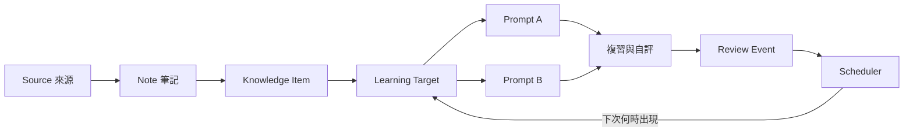
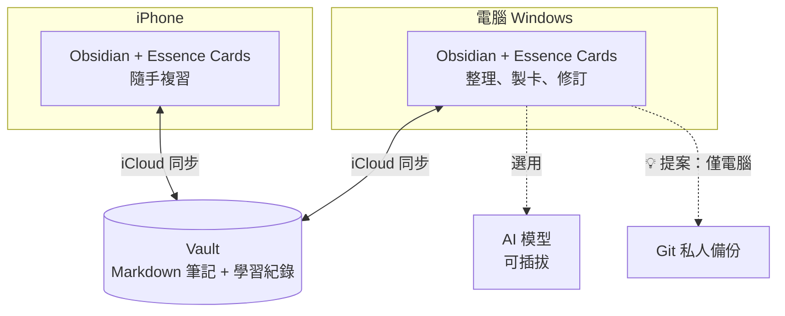

# Essence Cards｜架構

更新：2026-10-10｜狀態：重新釐清中（第 4～6 步，見[路線圖](roadmap.md#目前任務架構釐清七步)）

這份文件回答「技術上怎麼組成」。為什麼做、做到什麼程度見[產品定義](product.md)。

狀態標示：✅ 已確認｜🔁 舊共識，待重新確認｜💬 待討論｜💡 助理提案

## 1. 術語表

| 名詞 | 定義 | 狀態 |
|---|---|---|
| Source（來源） | 課本、PDF、網頁、影片等原始材料 | ✅ |
| Note（筆記） | Obsidian 裡的一篇 Markdown，是人閱讀的單位 | ✅ |
| Knowledge Item（知識項目） | 最小的「有意義知識單位」 | ✅ |
| Learning Target（學習目標） | 最小的「可獨立判斷學生會不會的學習目標」；排程的單位 | ✅ |
| Prompt（題目） | 為了檢核某個學習目標，呈現給學生的一次具體刺激；同一目標可以有多種問法 | ✅ |
| Card（卡片） | 目前主要的題目呈現方式：提示 → 想答案 → 翻面 → 自評 | ✅ |
| Review Event（複習紀錄） | 一次作答的結果 | 💬 |
| Scheduler（排程器） | 依複習紀錄決定下次出現時間；可以替換 | ✅ |
| Review Debt（複習債務） | 每個學習目標帶給未來的複習成本 | ✅ |
| Concept（概念） | 跨年級共用的知識節點 | 💡 願景，未採用 |

以上 ✅ 項目都在 2026-10-09 討論中確認（[D-010](decisions.md#d-010-三層概念模型)）。

> 參考：Knowledge Item → Learning Target → Prompt 的關係，和 Anki 的 Note → Card 模型很接近（一則筆記產生多張各自排程的卡）。這代表方向已被驗證可行，可以直接借鏡。

## 2. 概念模型 🔁（第 4 步）

已確認 ✅：

- 同一學習目標的不同問法共用學習狀態與排程；不同學習目標各自排程。
- 一個學習目標可以綜合多個知識項目。
- 方向不同的能力是不同的目標，例如英→中、中→英、拼字。
- 簡單情境自動退化成 1:1:1（例如單字卡），使用者看不到三層結構。

待決 💬：

- v1 要不要把 Knowledge Item 做成獨立的資料，還是卡片直接錨定在筆記段落？
- Learning Target 要預先建立，還是依學生狀態動態產生？
- 筆記裡怎麼定位：block ID 要不要寫進筆記？要怎麼隱藏？

## 3. 模組邊界 🔁（第 5 步）

| 模組 | 責任 | 狀態 |
|---|---|---|
| Essence Cards（本 repo） | 製卡、複習、檢核、排程、選用的 AI 輔助 | ✅ |
| Essence Capture（另一個 repo，尚未建立） | 來源 → 可讀、可編輯的 Obsidian 筆記；給通用型使用者，不限學生 | ✅ |

已確認 ✅（[D-006](decisions.md#d-006-兩個獨立外掛)、[D-008](decisions.md#d-008-學習紀錄與來源修改)、[D-009](decisions.md#d-009-一般筆記可直接使用)）：

- 兩個外掛各自安裝、各自可用，不要求同時運作，彼此沒有執行上的依賴。
- Cards 接受一般手寫或其他工具產生的筆記；YAML 不是使用門檻。
- 來源修改時，只提示「可能影響哪些卡」，不自動改卡、不重設進度。

待決 💬：

- 誰負責把筆記拆成 Knowledge Item？舊共識 C-022 把「AI 整理與萃取」放在 Capture；2026-10-09 使用者提議 Capture 只做到可讀筆記加上共同約定（例如 YAML），拆解交給 Cards 的 AI。
- 共同約定最少需要哪些欄位？

## 4. 平台與裝置 ✅

- 平台是 Obsidian 外掛（[D-004](decisions.md#d-004-第一版平台)）。同步沿用使用者既有的 iCloud，不疊加其他同步服務。
- 2026-10-07 可丟棄原型已通過 Windows 與 iPhone 的最小實機驗證：自訂介面、筆記讀寫、iCloud 往返。原型程式已從 main 刪除，保留在 git 歷史（見 [archive](archive/README.md)）。
- 限制：
  - 手機外掛不能使用 Node.js／Electron。
  - Vault 不是資料庫，跨裝置同時寫入沒有保證。
  - Obsidian 官方指出 Windows 上的 iCloud 可能造成檔案重複或損壞。

## 5. 資料存放 💬（第 6 步）

已確認 ✅：

- 學習紀錄與排程由 Cards 管理，不在每次作答時改寫筆記的 YAML。
- 作答保留當時的題目版本；筆記修改後，舊紀錄的意義不變。

設計提案 💡（來自舊技術路線圖，待驗證）：

- 知識留在 Markdown。學習紀錄由每台裝置各自追加寫入，避免 iCloud 互相覆寫；索引可以從紀錄重建。
- Git 只在電腦執行，負責歷史與救回；iCloud 負責同步。完整 Git 設計見 [v0 技術路線圖](archive/v0-planning/technical-roadmap.md#git-備份與版本回復的設計重點)。

## 6. AI 的位置 ✅（細節之後專門討論）

- 沒有 AI 時，Essence Cards 是完整的間隔重複複習軟體。
- 接上 AI 後，它成為「知識 → 複習」的轉換系統，例如產生題目、評估答案、解釋錯誤。
- 模型可以插拔，不指定供應商；AI 的建議與人的確認分開記錄（[D-007](decisions.md#d-007-ai-選用且可插拔)）。
- AI 最有價值的位置在「來源 → 知識項目 → 學習目標 → 題目」這段；「複習 → 檢核 → 排程」這段不需要 AI。
