# Essence Cards｜架構圖總入口

更新日期：2026-10-07。學習圖 v2.1、技術／路線圖 v1.2；功能 Mermaid 圖依目錄 v0.2 產生。

| B-ID | 藍圖 | 適合用來討論 | 主要依據 |
|---|---|---|---|
| B-001 | [知識學習架構](essence-cards-architecture.svg) | 輸入、整理、學習與回饋的整體循環 | [學習藍圖](../learning-blueprint.md) |
| B-002 | [技術架構與 Git](essence-cards-technical-architecture.svg) | 裝置、資料、AI、同步與回復分工 | [技術文件](../technical-roadmap.md) |
| B-003 | [開發路線圖](essence-cards-development-roadmap.svg) | 驗證門檻、開發順序及轉向條件 | [技術文件](../technical-roadmap.md)、[UI 原型狀態](../obsidian-ui-probe.md) |
| B-004 | [功能架構總覽（Mermaid）](functions.md) | 19 個 F-ID 的分區、關係及共用能力 | [功能目錄](../function-discussions.md) |

四張圖與目前狀態也放在[畫板藍圖索引](../blueprints.md)，同時生成到桌面／手機看板。圖中草案與待驗證項目不當成已實作功能。

## 功能架構總覽



[查看 Mermaid、功能對照表及其他圖的映射](functions.md)。分區總覽與既有三圖互補；後續狀態／資料或操作細圖使用新 B-ID 登錄，不將全部細節塞入主圖。

## 知識學習架構藍圖


這張圖以「輸入 → 整理 → 學習 → 回饋」的整體學習循環呈現，取消固定流程數與步驟編號。保留使用者手繪的來源輸入、整理產出、複習評量與回饋循環，補上已確認的材料關聯、學習紀錄與錯因處理。它呈現產品的概念架構；欄位、算法、介面、自動化程度與第一版範圍仍待討論。

主圖直接以輸入、整理、學習與回饋分區。輸入包含來源獲取；整理包含概念筆記、關聯與比較；學習包含教材、卡片、作答、評量與學習紀錄；下方回饋區包含補強修訂及復盤安排，透過直線回到整理或學習。

| 圖中功能 | 作用 |
|---|---|
| 來源輸入 | 帶入文字、圖片、PDF、影音、網頁、YouTube 與 Podcast，保留來源定位 |
| 整理與知識基礎 | 選取重點、萃取概念，建立結構化筆記、相似概念關聯與比較表 |
| 學習材料 | 依需要製作互動教材與記憶卡，連回相關概念 |
| 試題／考題閃卡 | 依真題、筆記及歷次錯題出題，檢驗理解與應用 |
| 作答、評量、紀錄 | 保存回答、回饋與學習證據；具體欄位待討論 |
| 錯因診斷與補強 | 依忘記、混淆、應用困難或題目有誤選擇補強與修訂 |
| 復盤與學習安排 | 區分間隔複習與主題復盤，安排下一輪學習 |

綠色箭頭表示資料與學習流；灰色箭頭表示將學習紀錄送入回饋；橘色箭頭表示回寫筆記或更新教材與題目；藍色箭頭表示後續學習與複習安排。連接箭頭均為直線，透過功能分組與位置對齊避免交叉及繞路。下方共用關聯串接來源、概念、教材、題目及作答紀錄。

圖中未逐一繪出所有操作入口；直接匯入真題或卡片後補上概念關聯的方向也已確認。來源清單表示完整藍圖的方向，不代表第一版全部支援。

- [可編輯 SVG](essence-cards-architecture.svg)
- [架構呈現方式 C-009](../consensus.md#c-009-以整體學習循環呈現架構已確認)
- [已確認方向 C-008](../consensus.md#c-008-共用知識基礎與學習回饋循環已確認)
- [學習循環與功能藍圖](../learning-blueprint.md)
- [圖版重排與連線原則](../discussions/2026-10-06-diagram-layout.md)
- [學習循環主軸討論](../discussions/2026-10-06-integrated-learning-cycle.md)
- [手繪藍圖整合摘要](../discussions/2026-10-06-architecture-redraw.md)

## 重新產生圖檔

產生程式：[scripts/draw_architecture.py](../../scripts/draw_architecture.py)。需要 PyMuPDF、ReportLab、fontTools 與 DejaVu Sans 字型；中文字型取自 PyMuPDF 內建 CJK 字型。生成的 SVG 嵌入所需字型，文字仍可編輯。

```sh
python3 scripts/draw_architecture.py --output /tmp/essence-cards-diagram
```

尺寸與比例依美觀、架構分組及文字內容安排，不固定為產品要求。目前程式同時輸出 3300 × 2550 PNG、向量 PDF 與 SVG。更新文件時將 SVG 保存為本目錄的 `essence-cards-architecture.svg`，再檢查文字、箭頭及版面。

## 技術架構與開發路線圖

設計版 v1.2（2026-10-07）。第一版平台為 Obsidian 外掛，沿用既有 iCloud 為跨裝置驗證基線；資料、AI、Git 策略與開發順序均保留設計提案／待驗證狀態，正式功能尚未實作；可丟棄 UI 原型已依使用者回報通過 Windows／iPhone 最小實機驗收。


- [技術架構可編輯 SVG](essence-cards-technical-architecture.svg)
- [開發路線圖可編輯 SVG](essence-cards-development-roadmap.svg)
- [完整技術設計與 Git 重點](../technical-roadmap.md)

Git 設計保留：電腦限定、iCloud 同步／Git 歷史／GitHub 私人備份的分工、外部 .git、拉取策略、修改檢查點、個別回復與保護邊界。公開專案 repo 與個人私人筆記備份分開。

新圖產生程式：[scripts/draw_technical_blueprints.py](../../scripts/draw_technical_blueprints.py)。沿用既有圖檔工具與內嵌字型，輸出 SVG、PNG 及 PDF；SVG 保存於本目錄並嵌入畫板。

```sh
python3 scripts/draw_technical_blueprints.py --output /tmp/essence-cards-technical
```

## 圖表維護與同步

圖意由設計者核對；程式負責名稱與 F-ID 對齊、來源／產物快照及看板生成。這是持續維護流程，不會從聊天文字自行判定設計或完成狀態。

- [registry.json](registry.json)：每張圖的 B-ID、文字／程式來源與產物；新增圖必須加入，SVG 漏登錄會失敗。
- [review-state.json](review-state.json)：核對過的來源與產物 SHA-256；只記錄變更基線，不能證明語意正確。
- [check_diagrams.py](../../scripts/check_diagrams.py)：檢查索引配對、路徑、漏登錄與快照；來源或圖檔變動會指出受影響的 B-ID。

維護順序：

1. 更新功能／學習／技術文件與共識；先看檢查指出的受影響圖，另以設計判斷確認跨圖關係。
2. 更新各圖的可編輯來源；功能名稱來自目錄，功能新增或拆分時也須調整分區。關係變動更新產生程式中的箭頭，不單獨修生成的 SVG。
3. 重新產生圖；檢查實際渲染、ID、方向、狀態與相互參照。若文字變動不影響圖，核對後可以保留圖檔。
4. 只對已核對的圖明列 ID 記錄快照，例如 `python3 scripts/check_diagrams.py --record B-004`；不要為了通過檢查直接重記全部圖。
5. 執行下面的檢查、重建兩份看板，將文字、圖表來源、產物、登錄／快照與 HTML 一起提交。

```sh
python3 scripts/build_function_diagram.py --check
python3 scripts/check_diagrams.py --check
python3 -m unittest discover -s tests -v
python3 scripts/build_board.py
python3 scripts/build_board.py --check
```

GitHub 工作流程先執行功能與全部圖表檢查，通過後才生成、提交及發布看板。它不會自動更新核對快照；來源變動而未核對時停止，避免舊圖跟著新文字發布。新增圖表也套用同一規則。

功能 Mermaid 來源與對照文件：`python3 scripts/build_function_diagram.py`。渲染使用官方 [Mermaid CLI](https://github.com/mermaid-js/mermaid-cli)，固定 12.0.0；需要 Chromium、PyMuPDF、fontTools 與 Linux fontconfig。使用暫存字型設定並內嵌字型，靜態看板不載入外部 Mermaid 程式。

```sh
npm install --prefix /tmp/essence-mermaid @mermaid-js/mermaid-cli@12.0.0
python3 scripts/render_function_diagram.py --mmdc /tmp/essence-mermaid/node_modules/.bin/mmdc
```

已有 Chromium 可加 `--browser /path/to/chromium`；新環境需先準備可執行瀏覽器。程式版本或字型工具更新須重新檢查渲染。既有 SVG 的重建命令見上方；學習圖輸出的 `Essence-Cards_架構藍圖.svg` 需複製為本目錄的 `essence-cards-architecture.svg`，PNG／PDF 預覽不納入圖表登錄。
