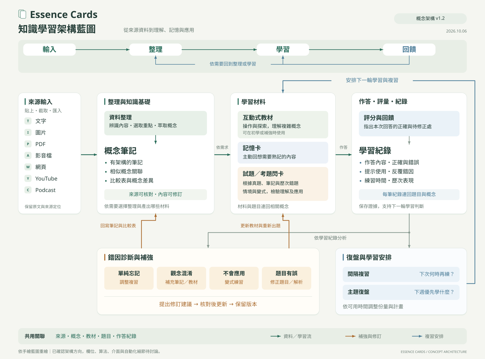

# Essence Cards｜知識學習架構藍圖

更新日期：2026-10-06。圖版：概念架構 v1.2。



這張圖以「輸入 → 整理 → 學習 → 回饋」的整體學習循環呈現，取消固定流程數與步驟編號。保留使用者手繪的來源輸入、整理產出、複習評量與回饋循環，補上已確認的材料關聯、學習紀錄與錯因處理。它呈現產品的概念架構；欄位、算法、介面、自動化程度與第一版範圍仍待討論。

上方主軸對應下方功能：輸入包含來源獲取；整理包含概念筆記、關聯與比較；學習包含教材、卡片、作答與評量；回饋包含補強修訂及復盤安排。回饋可依需要回到整理或學習。

| 圖中功能 | 作用 |
|---|---|
| 來源輸入 | 帶入文字、圖片、PDF、影音、網頁、YouTube 與 Podcast，保留來源定位 |
| 整理與知識基礎 | 選取重點、萃取概念，建立結構化筆記、相似概念關聯與比較表 |
| 學習材料 | 依需要製作互動教材與記憶卡，連回相關概念 |
| 試題／考題閃卡 | 依真題、筆記及歷次錯題出題，檢驗理解與應用 |
| 作答、評量、紀錄 | 保存回答、回饋與學習證據；具體欄位待討論 |
| 錯因診斷與補強 | 依忘記、混淆、應用困難或題目有誤選擇補強與修訂 |
| 復盤與學習安排 | 區分間隔複習與主題復盤，安排下一輪學習 |

綠色箭頭表示資料與學習流；灰色分支表示依學習紀錄分析；橘色箭頭表示補強與修訂；藍色回路表示後續學習與複習安排。下方共用關聯串接來源、概念、教材、題目及作答紀錄。

圖中未逐一繪出所有操作入口；直接匯入真題或卡片後補上概念關聯的方向也已確認。來源清單表示完整藍圖的方向，不代表第一版全部支援。

- [可編輯 SVG](essence-cards-architecture.svg)
- [架構呈現方式 C-009](../consensus.md#c-009-以整體學習循環呈現架構已確認)
- [已確認方向 C-008](../consensus.md#c-008-共用知識基礎與學習回饋循環已確認)
- [學習循環與功能藍圖](../learning-blueprint.md)
- [學習循環主軸討論](../discussions/2026-10-06-integrated-learning-cycle.md)
- [手繪藍圖整合摘要](../discussions/2026-10-06-architecture-redraw.md)

## 重新產生圖檔

產生程式：[scripts/draw_architecture.py](../../scripts/draw_architecture.py)。需要 PyMuPDF、ReportLab、fontTools 與 DejaVu Sans 字型；中文字型取自 PyMuPDF 內建 CJK 字型。生成的 SVG 嵌入所需字型，文字仍可編輯。

```sh
python3 scripts/draw_architecture.py --output /tmp/essence-cards-diagram
```

程式同時輸出 3600 × 2670 PNG、向量 PDF 與 SVG。更新文件時將 SVG 保存為本目錄的 `essence-cards-architecture.svg`，再檢查文字、箭頭及版面。
