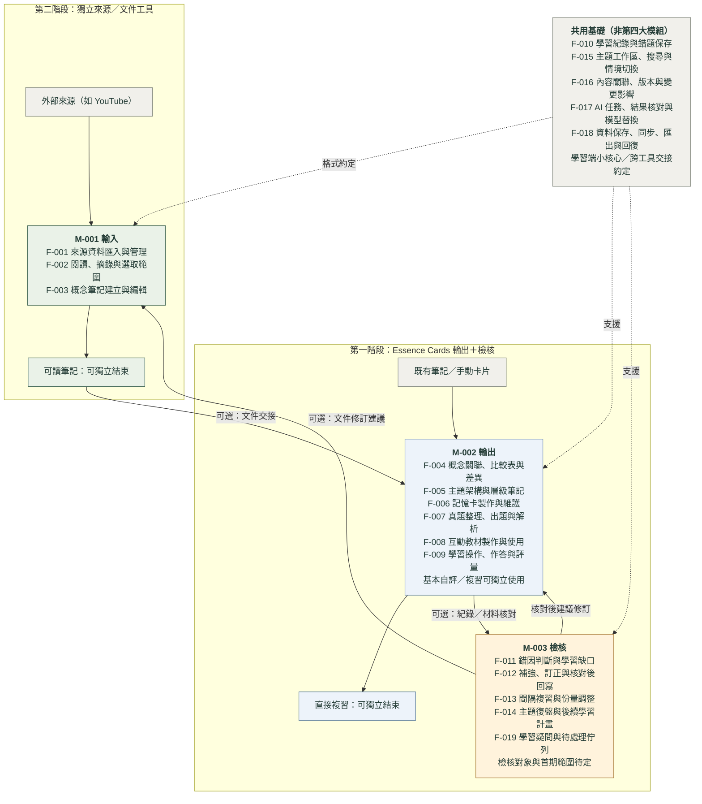

# Essence Cards｜功能架構總覽

圖表 ID：B-004｜依功能目錄 v0.4 產生｜更新日期：2026-10-07（Asia/Taipei）

狀態：兩階段交付及輸入、輸出可獨立使用已確認（C-020、C-022）。第一階段先做 Essence Cards 的輸出＋檢核，第二階段再獨立交付來源／文件工具。19 項功能的責任候選映射、首期功能與卡型、檢核範圍、算法、程式邊界及交接細節仍待討論；圖中功能不是完成清單，也不承諾首期包含全部 19 項。

這張圖回答「三個功能模組如何分成兩個產品／交付單位，並選擇性整合」。M-001 輸入、M-002 輸出（教材、心智圖、閃卡製作與使用）、M-003 檢核保留為功能 M-ID；C-022 取代 C-020 的同一外掛內整合三模組安排。M-002／M-003 屬第一階段 Essence Cards，M-001 屬第二階段獨立來源／文件工具。[三大模組架構](../module-architecture.md)保存方向與使用情境；[整合契約草案](../integration-contract.md)從第一階段規劃文件、來源、附件及版本交接，具體格式尚未選定。既有「輸入、整理、學習、回饋」仍是學習循環視角，兩者並存，不要求使用者依序走完。

每個 F-ID 在主要節點標籤出現一次，完整功能名稱由[功能目錄](../function-discussions.md)自動帶入。這是討論用的責任候選映射，有跨界能力，不代表唯一歸屬或已定案的程式邊界。實線表示操作入口、產出或可選交接；虛線表示 Essence Cards 內部資料核心支援或跨產品格式約定，不表示 API 呼叫、共用執行程序或強制流程。顏色只區分用途，不表示完成或採用狀態。

第二階段輸入工具可單獨把 YouTube 等來源整理為可讀筆記，完成後即可結束；圖示為需求情境，不表示完整 YouTube API 或轉錄已實作。來源工具的部署方式待定，不預設為 Obsidian 外掛。第一階段可從既有筆記／手動卡片直接製作、複習及檢核；來源取得與輸入工具不是第一階段使用的必要條件，也不須啟用完整檢核才能複習。筆記到輸出、輸出到檢核都是可選交接；檢核可提出經核對的材料修訂，跨產品箭頭只傳達文件修訂建議，不強制呼叫輸入工具。

初期整合以檔案交接與人工選取為候選方式，API 可選且可後續再議。從首期預留文件／來源／附件／版本契約，保留可核對的交接與修訂；不要求兩產品共享可變狀態或同時執行。契約目前是設計草案，不表示 schema、欄位、協定或連接器已定案。

F-009 的操作與基本自評在輸出使用，較深評量可與檢核協作；F-013 的基本複習規則可供輸出使用，不把 M-003 當作啟用閃卡的先決條件。學習事件、情境存取、ID／關聯、資料保存與可選 AI 轉接屬共用基礎的責任候選：Essence Cards 保留本地資料核心，跨產品部分透過文件契約約定，不新增第四大模組，也不表示兩工具必須使用同一套核心程式或共用資料庫。各獨立操作保留人工核對；AI 可選，AI 結果仍須核對。正式紀錄、保存失敗處理及排程細節待討論，修訂保留可核對的版本與原事件。

## 功能與圖中分區對照

| F-ID | 功能討論單位 | 圖中責任候選映射（可跨界） | 交付候選／確認邊界 |
|---|---|---|---|
| F-001 | 來源資料匯入與管理 | M-001 輸入 | 第二階段來源工具；格式待選，接收既有資料不必等取得／轉換 |
| F-002 | 閱讀、摘錄與選取範圍 | M-001 輸入 | 第二階段來源選取；已有筆記選段可供輸出跨界使用 |
| F-003 | 概念筆記建立與編輯 | M-001 輸入 | 第二階段文件建立；既有筆記編輯／核對沿用宿主及學習端 |
| F-004 | 概念關聯、比較表與差異 | M-002 輸出 | 簡化候選；手動關聯先評估 |
| F-005 | 主題架構與層級筆記 | M-002 輸出 | 簡化候選；呈現形式待議 |
| F-006 | 記憶卡製作與維護 | M-002 輸出 | 起步候選；基本卡型與採用操作待選 |
| F-007 | 真題整理、出題與解析 | M-002 輸出 | 簡化候選；題型、候選預覽與版本待議 |
| F-008 | 互動教材製作與使用 | M-002 輸出 | 深化候選；有限模板先評估 |
| F-009 | 學習操作、作答與評量 | M-002 輸出 | 起步候選；自評／客觀評分先議 |
| F-011 | 錯因判斷與學習缺口 | M-003 檢核 | 簡化候選；人工確認先議 |
| F-012 | 補強、訂正與核對後回寫 | M-003 檢核 | 簡化候選；人工修訂及結案先議 |
| F-013 | 間隔複習與份量調整 | M-003 檢核 | 起步候選；規則、門檻與估時待議 |
| F-014 | 主題復盤與後續學習計畫 | M-003 檢核 | 簡化候選；不先承諾掌握率指標 |
| F-019 | 學習疑問與待處理佇列 | M-003 檢核 | 功能方向已確認；第一版候選，細節未決 |
| F-010 | 學習紀錄與錯題保存 | 共用基礎（非第四大模組） | 起步候選；最小必要欄位待議 |
| F-015 | 主題工作區、搜尋與情境切換 | 共用基礎（非第四大模組） | 簡化候選；固定入口仍未決 |
| F-016 | 內容關聯、版本與變更影響 | 共用基礎（非第四大模組） | 起步候選；提醒先議，自動比對待驗證 |
| F-017 | AI 任務、結果核對與模型替換 | 共用基礎（非第四大模組） | 簡化候選；AI 依 P3 細化 |
| F-018 | 資料保存、同步、匯出與回復 | 共用基礎（非第四大模組） | 基線驗證；細節與完整範圍待設計 |

## 與其他藍圖互相參照

| 藍圖 | 回答的問題 | 本圖的對應 |
|---|---|---|
| [B-001 知識學習架構](essence-cards-architecture.svg) | 學習循環與共用知識基礎如何運作？ | 學習循環視角與三大模組互相對照；不強制依序操作 |
| [B-002 技術架構](essence-cards-technical-architecture.svg) | 裝置、資料、AI、同步與 Git 如何分工？ | Essence Cards 的資料、事件、存取、AI 與保護基礎；來源工具透過文件契約整合，部署待定 |
| [B-003 開發路線圖](essence-cards-development-roadmap.svg) | 先驗證什麼，再開發什麼？ | 保留 P0／P1 驗證門檻；第一階段輸出＋檢核、第二階段獨立輸入，AI 深化另議；不從 F 編號推導順序 |

[共用藍圖索引](../blueprints.md)保存每張圖的目前狀態；[圖表維護方式](README.md#圖表維護與同步)說明如何隨決策更新。T-011 的可丟棄 UI 原型已依使用者回報通過 Windows／iPhone 最小實機驗證；正式功能與完整 P0 仍未通過，原型結果不能取代離線事件、併發、附件及 Git 回復驗證。

## 原始碼與生成

- [Mermaid 原始碼](essence-cards-functions.mmd)
- [靜態 SVG](essence-cards-functions.svg)，供桌面／手機看板離線閱讀。
- [產生程式](../../scripts/build_function_diagram.py)：名稱與 F-ID 取自目錄，分區及箭頭仍須設計者核對。

勿單獨修改生成的本文件、Mermaid 或 SVG。更新功能目錄；若關係變動，修改產生程式；重新渲染、核對所有受影響圖表，再記錄來源快照及建置看板。
