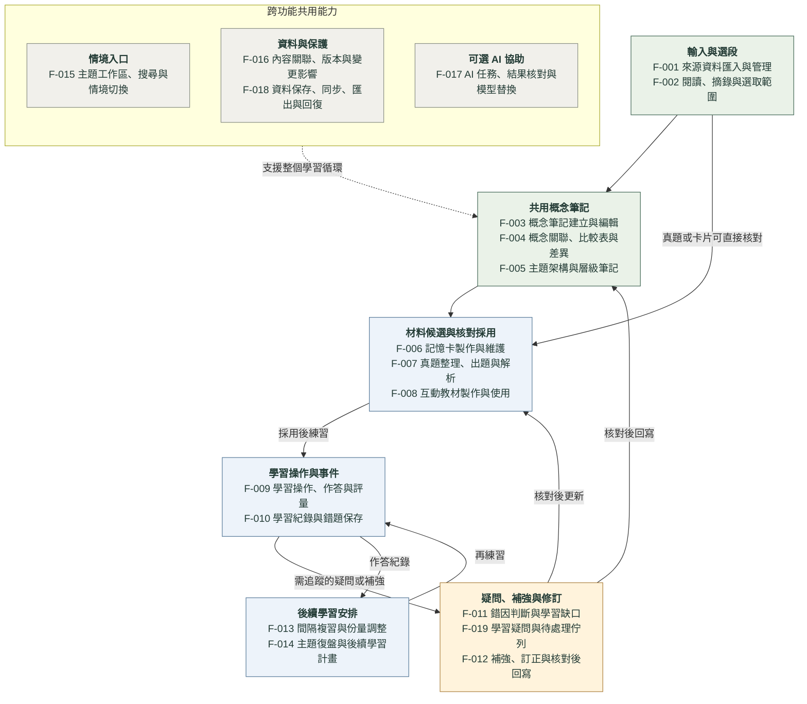

# Essence Cards｜功能架構總覽

圖表 ID：B-004｜依功能目錄 v0.2 產生｜更新日期：2026-10-07（Asia/Taipei）

狀態：目前規劃草案。學習循環、共用概念及 C-017 的細化方向已確認；功能邊界、箭頭細節、算法與第一版範圍仍待逐項確認。圖中功能不是完成清單。

這張圖回答「整個專案有哪些功能、如何連接」。以功能分區呈現 19 項討論單位，保留 F-ID，方便回到[功能目錄](../function-discussions.md)；完整名稱由目錄自動帶入。實線表示主要資料／學習與回饋關係，虛線表示共用支援，不表示 API 呼叫或固定操作順序。顏色只區分用途，不表示完成或採用狀態。

每個方塊包含多項功能，不要求全部依序執行。既有真題／卡片可直接核對採用，再補概念關聯；一般忘記可進複習安排，需追蹤的補強或內容疑義才進 F-019。回寫須核對，舊作答事件保留。F-015、F-016、F-018 橫跨整個循環；F-017 接入可獨立使用的人工流程，AI 結果仍須核對。

## 功能與圖中分區對照

| F-ID | 功能討論單位 | 圖中分區 | 第一版候選／確認邊界 |
|---|---|---|---|
| F-001 | 來源資料匯入與管理 | 輸入與選段 | 起步候選；格式待選，收藏不自動製卡 |
| F-002 | 閱讀、摘錄與選取範圍 | 輸入與選段 | 起步候選；人工選段與定位先討論 |
| F-003 | 概念筆記建立與編輯 | 共用概念筆記 | 起步候選；最小關聯先議，拆分／合併待議 |
| F-004 | 概念關聯、比較表與差異 | 共用概念筆記 | 簡化候選；手動關聯先評估 |
| F-005 | 主題架構與層級筆記 | 共用概念筆記 | 簡化候選；呈現形式待議 |
| F-006 | 記憶卡製作與維護 | 材料候選與核對採用 | 起步候選；基本卡型與採用操作待選 |
| F-007 | 真題整理、出題與解析 | 材料候選與核對採用 | 簡化候選；題型、候選預覽與版本待議 |
| F-008 | 互動教材製作與使用 | 材料候選與核對採用 | 深化候選；有限模板先評估 |
| F-009 | 學習操作、作答與評量 | 學習操作與事件 | 起步候選；自評／客觀評分先議 |
| F-010 | 學習紀錄與錯題保存 | 學習操作與事件 | 起步候選；最小必要欄位待議 |
| F-011 | 錯因判斷與學習缺口 | 疑問、補強與修訂 | 簡化候選；人工確認先議 |
| F-019 | 學習疑問與待處理佇列 | 疑問、補強與修訂 | 功能方向已確認；第一版候選，細節未決 |
| F-012 | 補強、訂正與核對後回寫 | 疑問、補強與修訂 | 簡化候選；人工修訂及結案先議 |
| F-013 | 間隔複習與份量調整 | 後續學習安排 | 起步候選；規則、門檻與估時待議 |
| F-014 | 主題復盤與後續學習計畫 | 後續學習安排 | 簡化候選；不先承諾掌握率指標 |
| F-015 | 主題工作區、搜尋與情境切換 | 情境入口 | 簡化候選；固定入口仍未決 |
| F-016 | 內容關聯、版本與變更影響 | 資料與保護 | 起步候選；提醒先議，自動比對待驗證 |
| F-018 | 資料保存、同步、匯出與回復 | 資料與保護 | 基線驗證；細節與完整範圍待設計 |
| F-017 | AI 任務、結果核對與模型替換 | 可選 AI 協助 | 簡化候選；AI 依 P3 細化 |

## 與其他藍圖互相參照

| 藍圖 | 回答的問題 | 本圖的對應 |
|---|---|---|
| [B-001 知識學習架構](essence-cards-architecture.svg) | 學習循環與共用知識基礎如何運作？ | 輸入、整理、材料、作答與回饋分區 |
| [B-002 技術架構](essence-cards-technical-architecture.svg) | 裝置、資料、AI、同步與 Git 如何分工？ | F-015 至 F-018；電腦處理及手機學習／疑問 |
| [B-003 開發路線圖](essence-cards-development-roadmap.svg) | 先驗證什麼，再開發什麼？ | P0／P1 驗資料基礎，P2 接通人工循環，P3 接 AI；不從 F 編號推導開發順序 |

[共用藍圖索引](../blueprints.md)保存每張圖的目前狀態；[圖表維護方式](README.md#圖表維護與同步)說明如何隨決策更新。T-011 的可丟棄 UI 原型仍待實機，不能視為正式功能已完成，也不能取代 P0。

## 原始碼與生成

- [Mermaid 原始碼](essence-cards-functions.mmd)
- [靜態 SVG](essence-cards-functions.svg)，供桌面／手機看板離線閱讀。
- [產生程式](../../scripts/build_function_diagram.py)：名稱與 F-ID 取自目錄，分區及箭頭仍須設計者核對。

勿單獨修改生成的本文件、Mermaid 或 SVG。更新功能目錄；若關係變動，修改產生程式；重新渲染、核對所有受影響圖表，再記錄來源快照及建置看板。
