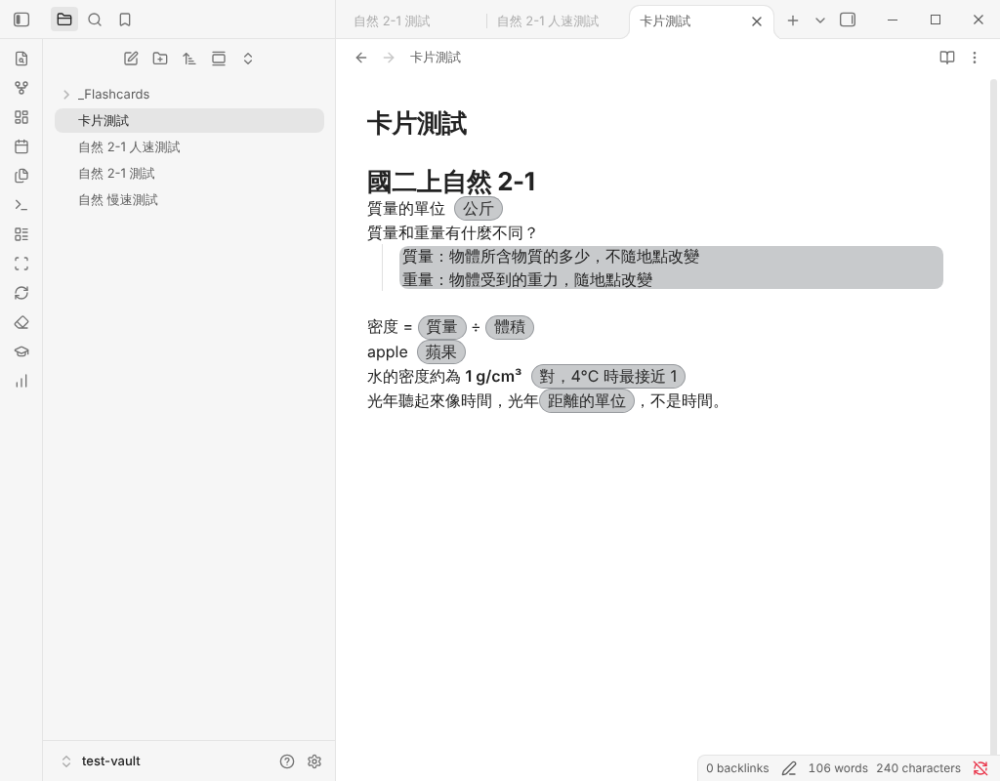
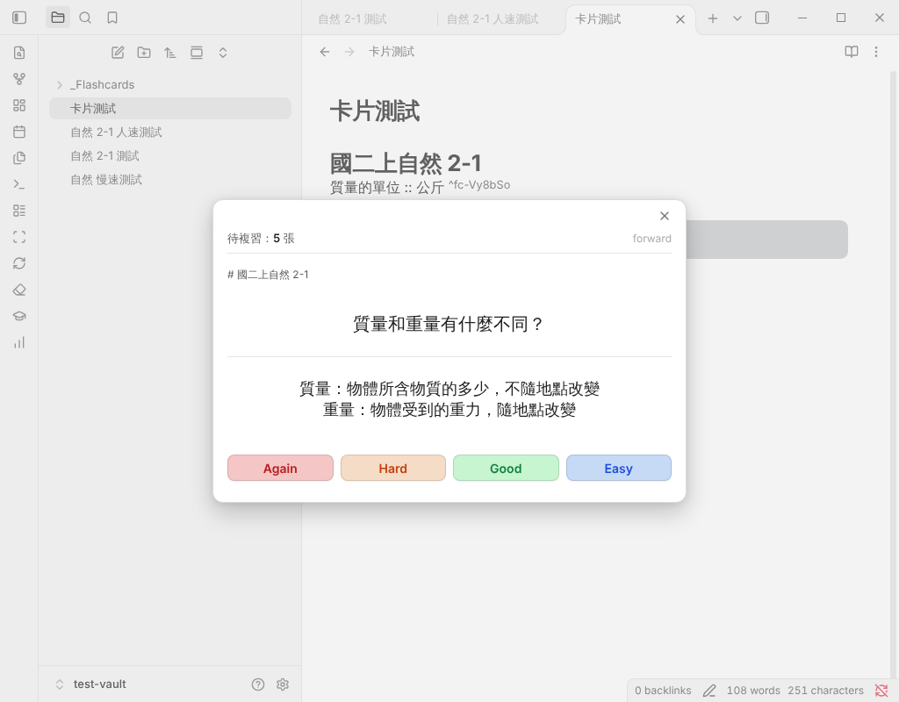

# Essence Cards｜舊外掛分析：AI-Enriched Flashcards

更新：2026-10-10（第二版）｜分析對象：[GollyKuo/Obsidian-Flash-Card](https://github.com/GollyKuo/Obsidian-Flash-Card) v0.1.30（MIT，作者為使用者本人）

狀態：💡 助理分析。文中的「建議」都是待討論的提案，不是決定；已確認的部分會標出決策編號。

> 這份報告是[v1 開發前要做的事](../roadmap.md#v1-開發前要做的事)中「出題語法定稿」的前置工作（[D-030](../decisions.md#d-030-出題語法規範)）。
>
> **使用方式（2026-10-10 使用者要求）**：舊 repo 是用來找出對本專案有幫助的觀念，不是直接拿來用。每個部分都先以最高標準想出最好的做法；想不出更好的，才沿用舊做法；不為了給答案而硬湊。依這個標準重新設計的結果見 [§7](#7-以最高標準重新設計)。

## 一句話結論

舊外掛的**工程底子很扎實**：解析、同步、儲存都有測試，69 個測試全部通過。使用者重視介面體驗，所以約三分之一的程式投入在編輯器呈現，這是正確的重點方向（[D-044](../decisions.md#d-044-介面體驗是重點方向)）。

問題出在兩個結構性的選擇：
- **卡片寫在任何一般筆記裡**：造成誤判，也讓呈現的工程變得很複雜。
- **複習資料只存目前狀態**：卡片暫時消失時，進度就跟著被刪掉。

這兩點都已實測重現（[§5](#5-發現的問題)）。Essence Cards 的卡組獨立存放（D-025）與只往後追加的複習紀錄（D-035），從結構上避開了這些問題。重新設計後，同樣好的介面可以用更少、更乾淨的程式做出來（[§7](#7-以最高標準重新設計)）。

## 1. 專案概況

| 項目 | 內容 |
|---|---|
| 名稱 | AI-Enriched Flashcards（Obsidian 外掛，`isDesktopOnly: false`） |
| 定位 | RemNote 風格的互動、FSRS 排程、在 Obsidian 原生編輯卡片；AI 豐富化為規劃 |
| 開發期間 | 依 dev_log 與 RoadMap，v0.1.5～v0.1.30 集中在 2026-03-29～04-01 |
| 規模 | 76 個檔案；程式約 5,000 行，測試約 1,400 行 |
| 技術 | TypeScript、React 18、Tailwind（`fc-` 前綴、PostCSS PrefixWrap 隔離）、ts-fsrs 4.7.1、nanoid、esbuild、vitest |
| AI | 只有設定欄位（Gemini、模型名稱、API 金鑰），功能尚未實作 |
| 驗證 | 2026-10-10 實測：安裝套件後執行原有測試，12 個檔案、69 個測試全部通過；另用它真正的程式寫了 5 個重現測試（[附錄](#附錄重現測試)）；並在雲端安裝 Obsidian 1.14.4 實際操作（[附錄二](#附錄二在-obsidian-實際操作)） |

## 2. 功能盤點

| 類別 | 做了什麼 |
|---|---|
| 語法 | 5 種卡：`問題 :: 答案`（正向）、`說明 ;; 概念`（反向）、`單字 ::: 翻譯`（雙向）、`==填空==`、`問題 ::` 加縮排的多行答案；另有內嵌包裹 `{{fc 正面 :: 背面 /fc}}`，用在段落中間 |
| ID | 游標離開卡片那一行時，在行尾加上 `^fc-xxxxxx`（nanoid 6 碼），用 `vault.process()` 原子寫入 |
| 同步 | 監聽檔案修改（600 ms 延遲合併）、改名、刪除；只收錄已經有 ID 的卡；可以重建整個 vault 的索引 |
| 儲存 | `_Flashcards/data.json` 是清單，每張卡一個 `Cards/<ID>.json`，裡面存題目與目前的 FSRS 狀態；有資料版本遷移與記憶體索引 |
| 複習 | React 彈出視窗：列出所有到期的卡，翻面後按 Again／Hard／Good／Easy；顯示標題路徑；填空題把 `==答案==` 換成底線 |
| 編輯器呈現 | 答案高亮（膠囊、純文字、淡色背景帶、右側線條）、隱藏 `::` 等符號與 ID、點擊答案才顯示原始語法 |
| 設定與維護 | 分頁式設定、高亮配色、AI 預留欄位；一鍵移除整個 vault 的 `^fc-` ID |
| 開發流程 | Instruction、RoadMap、dev_log、Retrospective、SKILL 五份規範；測試分快慢兩層、git hooks、一鍵發版、文件編碼檢查 |

## 3. 力氣花在哪裡

| 模組 | 程式行數 | 佔比 | 內容 |
|---|---|---|---|
| 編輯器呈現（editor、styles、高亮相關設定） | 約 1,800 | 約 35% | 高亮、隱藏語法與 ID、點擊顯示 |
| 儲存（store） | 1,128 | 22% | 分片儲存、索引、遷移、存檔佇列 |
| 解析（parser） | 472 | 9% | 5 種語法與內嵌包裹 |
| 同步（sync） | 397 | 8% | 檔案事件、同步狀態 |
| ID（blockid） | 356 | 7% | 補 ID、清除 ID |
| 複習（review、ui） | 226 | 約 4% | FSRS 包裝 61 行、複習視窗 165 行 |
| 其他（app、main、設定其餘部分） | 約 680 | 約 13% | 指令、設定頁 |

Retrospective 記錄的 4 個除錯案例中，3 個與編輯器呈現或 CSS 隔離有關（高亮失效、選擇器被錯誤加上前綴、內嵌語法與裝飾排序錯誤），1 個是文件編碼損壞。

**判讀**：使用者重視介面體驗，投入在呈現上的力氣方向正確（D-044）。代價高的原因在**做法**，不在投入：

- **在任意筆記裡做呈現**：必須同時顧及一般筆記的閱讀，又要藏住語法和 ID。
- **用「以畫面元件取代文字」的方式高亮**：文字被取代後就不能直接編輯，只好再做一套「點擊才顯示原文」的狀態機與排序防呆。

Essence Cards 一樣要把介面做好，但把力氣放在學生的複習畫面，以及家長閱讀、審核卡組的體驗，並改用更簡單的技術（[§7-8](#7-8-卡組筆記的呈現介面重點)）。

## 4. 值得參考的做法

依使用者的要求，下表是「觀念」的參考，不是直接沿用；「Essence 的做法」一欄寫出重新思考後的結論。

| # | 舊外掛的做法 | 好在哪裡 | Essence 的做法 |
|---|---|---|---|
| 1 | FSRS（ts-fsrs） | 現代間隔重複演算法，成熟、MIT 授權 | 採用 FSRS（[D-043](../decisions.md#d-043-排程採用-fsrs)），但改成從紀錄重播計算（§7-10） |
| 2 | 寫進筆記的隨機 ID | 改字、搬動都不會失去身分 | 觀念正確，沿用；字元與位置改良（§7-4） |
| 3 | 游標離開才寫 ID，用 `vault.process()` 原子寫入，寫入前再檢查 | 不打斷輸入、避免競態 | 原子寫入沿用；改成以「整篇筆記」為單位補 ID（§7-5） |
| 4 | 格式不合法就不解析 | 避免半解析（Case 003 的教訓） | 沿用，寫進語法規範 |
| 5 | 解析器是純函式，配單元測試 | 規則變動時能快速回歸 | 擴大成「核心不依賴 Obsidian」，並加上範本測試（§7-11、§7-13） |
| 6 | 存檔佇列（延遲合併、批次） | 減少頻繁寫檔 | 複習紀錄只追加，大部分情況用不到；快照寫入時再評估 |
| 7 | 資料版本與遷移 | 欄位改變時舊資料能升級 | 卡組屬性與紀錄格式加上版本欄位即可，規模小很多 |
| 8 | 複習時顯示標題路徑 | 學生知道卡片出自哪裡 | 顯示單元與出處 |
| 9 | 試驗 → 以穩定版重寫 → 發版的三段式節奏 | 試錯不污染正式程式 | 沿用 |
| 10 | Retrospective（記根因與錯誤方向）、手機相容檢查清單、文件編碼檢查 | 減少重複踩坑 | 沿用 |

## 5. 發現的問題

標「實測」的項目，已用舊外掛真正的程式重現（[附錄](#附錄重現測試)）。

### 5-1 一般筆記裡的內容被誤判成卡片（實測 R1）

解析器套用到整個 vault 的每一行，而且沒有排除程式碼區塊：

| 內容 | 被判成 |
|---|---|
| 程式碼區塊裡的 `auto v = std::vector<int>();` | 正向卡 |
| 程式碼 `for (i = 0;; i++) {}` | 反向卡 |
| Dataview 的欄位 `status:: 進行中` | 正向卡 |
| 用螢光筆標重點 `這段我用 ==螢光筆== 標重點` | 填空卡 |

游標離開這些行時，外掛會在行尾加上 `^fc-` ID，等於修改了使用者的筆記。使用手冊寫「程式碼區塊內不解析」，但這只適用於內嵌包裹語法；解析器本身沒有實作排除。

→ **Essence Cards**：卡片只寫在 `Essence Cards/` 裡的卡組筆記（D-025、D-041），來源筆記完全不碰。卡組筆記內也要排除程式碼（§7-1、§7-2）。

### 5-2 搬動卡片會讓進度歸零（實測 R2）

同步時，筆記裡找不到某個 ID，就把那張卡的資料連同 FSRS 進度一起刪掉。把一張複習過 2 次的卡從 A 筆記剪下、貼到 B 筆記：A 先同步，卡片被刪；B 再同步，以新卡建立。實測結果：複習次數從 2 變成 0，狀態回到「新卡」。

### 5-3 改卡改到一半剛好存檔，進度歸零（實測 R3）

Obsidian 在停止輸入後不久就自動存檔。若存檔當下那一行暫時不符合語法（例如正在重打 `::`），卡片就被刪除；改好後同一個 ID 以新卡重新建立。實測結果同 5-2。

→ **Essence Cards（5-2、5-3）**：複習紀錄只往後追加、跟卡組分開存（D-035）。卡片暫時消失不會刪除紀錄，同一個 ID 回來時進度就接得上。

### 5-4 只存「目前狀態」，沒有複習歷史

每張卡只存最新的 FSRS 數值，過去每次作答的紀錄沒有保留。所以無法：

- 計算記憶保持率（成功標準要用）
- 換一種排程演算法重算（D-012）
- 用自己的紀錄調整參數（D-043 的個人化）
- 看出哪些卡常錯

→ **Essence Cards**：D-035 保留每一次作答。

### 5-5 每次作答都改寫同一個卡片檔，跨裝置可能互相覆蓋

每按一次評分，就立即改寫那張卡的 JSON 檔。電腦和 iPhone 若在同步完成前都複習了同一張卡，iCloud 只會留下其中一邊。卡片數量多時，`Cards/` 會有上千個檔，清單檔 `data.json` 也會被兩端同時修改。

→ **Essence Cards**：每台裝置只寫自己的紀錄檔（D-035）。

### 5-6 反向卡、雙向卡在複習時沒有差別（實測 R4）

複習視窗對所有非填空卡都是「顯示正面 → 翻出背面」：

- `;;` 的行為和 `::` 相同。
- `:::` 只產生一張卡，沒有反方向。
- 一行有兩個 `==填空==` 時只產生一張卡，兩個空格一次全挖。

### 5-7 ID 有約 9% 不是合法的 Obsidian 區塊 ID（實測 R5）

- **原因**：依 Obsidian 說明，區塊 ID 只能用英文字母、數字和連字號；nanoid 的預設字元包含底線 `_`。
- **實測**：隨機產生 10 萬個 6 碼 ID，9.1% 含 `_`。
- **影響**：這些 ID 不會被 Obsidian 當成區塊 ID，閱讀模式不會自動隱藏，也無法用 `[[筆記#^ID]]` 連結。舊外掛另外寫了一個閱讀模式的清理器來藏這些文字。

### 5-8 同一套規則寫在好幾個地方

- **卡片語法**：解析器和高亮各定義一份。
- **ID 格式**：寫了 5 份，而且彼此不一致。例如閱讀模式的清理器只認「剛好 6 碼」，其他地方不限長度。

Retrospective 的 Case 003 寫到根因之一是「parser／highlighter／文件三者不同步」，這正是重複定義會造成的問題。

### 5-9 新卡立刻到期、沒有上限

新卡建立時就到期，複習視窗會列出所有到期卡。一次貼上 100 張卡，當天就要複習 100 張新卡。

### 5-10 複習畫面不渲染 Markdown

卡片內容以純文字顯示：粗體、連結會顯示原始符號，圖片和公式不會出現。自然科需要圖與公式。

### 5-11 沒有 ID 的卡不會被收錄

卡片要等游標離開那一行、補上 ID 之後才會被收錄。一次貼上很多卡（例如 AI 的輸出），必須逐行點過才會全部生效。

### 5-12 手機相容與金鑰存放

- 點擊顯示用的是 `mousedown`，複習視窗固定 540 px 寬，手機版的適配排在 v0.2，還沒開始。
- Gemini API 金鑰存在外掛設定檔，會跟著 vault 經 iCloud 同步。

### 5-13 文件與流程比程式還重

約 5,000 行程式，配上約 70 KB 的五份規範文件。4 天內約發了 25 個版本，連只改文件也要升版、寫 dev_log；RoadMap 同時有 Sprint A～G、V0.2～V0.5 兩套編號。這和 Essence Cards 在 D-014 重整文件時遇到的情況類似。

### 5-14 打字時補 ID 會吃掉文字（Obsidian 實測）

在新筆記裡依序輸入幾張卡：
- **吃掉文字**：第一張卡 `質量的單位 :: 公斤` 整行消失，它的 ID 被黏到下一行開頭。用正常打字速度、甚至每行停 3 秒，結果都一樣。
- **原因**：外掛用 `vault.process()` 直接改硬碟上的檔案，但編輯器裡還有尚未存檔的新內容，兩邊互相覆蓋。
- **教訓**：筆記開在編輯器時，必須透過編輯器寫入，不能直接改檔（§7-5）。

### 5-15 用方向鍵移動不會補 ID（Obsidian 實測）

外掛只在點擊與打字時檢查游標，用方向鍵逐行移動不會補 ID，所以那幾張卡不會被收錄。

### 5-16 按 Again 的卡，這次複習不會再出現（Obsidian 實測）

複習清單在打開視窗時就固定了。答錯的卡雖然幾分鐘後到期，但要關掉視窗重開才會再出現。

### 5-17 小細節

到期日以 UTC 日期分組，台灣時間早上 8 點才換日。目前只影響內部分組，不影響「是否到期」的判斷；做每日上限與統計時，要改用本地時間換日。

## 6. 對照表

| 主題 | 舊外掛 | Essence Cards | 看法 |
|---|---|---|---|
| 卡片放哪裡 | 任何筆記的任何一行 | 獨立的卡組筆記（D-025、D-041） | 舊外掛證明了混寫的代價 |
| 學習目標 | 沒有，一行一卡 | 學習目標＋題目池（D-010、D-028） | 表示方式見 §7-1 |
| ID | 行尾 `^fc-` + nanoid（9% 不合法） | 隨機短碼（D-034） | 改用原生區塊 ID 與安全字元（§7-4） |
| 補 ID | 追蹤游標所在的行 | 💡 停止輸入後（D-036） | 改成整篇一次補（§7-5） |
| 排程 | FSRS，存目前狀態 | FSRS（D-043），從紀錄重播 | §7-10 |
| 複習資料 | 每張卡一個檔，只存目前狀態 | 每台裝置每月一個紀錄檔，只追加（D-035） | Essence 已解決 5-2～5-5 |
| 新卡 | 立刻到期，沒有上限 | 每日上限（D-026） | 補上新卡上限 |
| 呈現 | 以元件取代文字，配點擊顯示 | 介面是重點（D-044） | 改成只上樣式（§7-8） |
| AI | 只有設定欄位 | 複製貼上＋API 直連、快照（D-039、D-042） | Essence 已有完整設計 |

## 7. 以最高標準重新設計

依使用者的標準：每一項先想最好的做法，找不到更好的才沿用舊外掛的做法。

| # | 項目 | 結論 |
|---|---|---|
| 7-1 | 學習目標的表示方式 | **有更好解**：清單縮排，取代上一版的「標題＝學習目標」 |
| 7-2 | 卡片符號 | **舊做法最好**：沿用 `::`、`==`，加上更嚴格的邊界 |
| 7-3 | 一行多個填空 | **有更好解**：一個學習目標，每次挖一個空輪流出 |
| 7-4 | ID 的字元與位置 | **有更好解**：Obsidian 原生區塊 ID、只用安全字元 |
| 7-5 | 補 ID 的時機 | **有更好解**：以整篇筆記為單位 |
| 7-6 | 題目怎麼識別 | **有更好解**：用內容指紋，不需要題號 |
| 7-7 | 語法規則放哪裡 | **有更好解**：單一來源 |
| 7-8 | 卡組筆記的呈現 | **有更好解**：只上樣式、不取代文字；閱讀模式做精緻呈現 |
| 7-9 | 複習資料 | **Essence 已更好**（D-035） |
| 7-10 | 排程 | **FSRS 沿用**，計算方式更好 |
| 7-11 | 程式分層 | **有更好解**：核心不依賴 Obsidian；能用 Obsidian 原生能力就不自己做 |
| 7-12 | 介面技術 | **待定**：不用 Tailwind 與前綴包裝 |
| 7-13 | 測試 | **有更好解**：範本測試與整學期模擬 |
| 7-14 | 開發節奏 | **舊做法最好**：三段式、Retrospective |

### 7-1 學習目標的表示方式

考慮過四種寫法：

| 寫法 | 優點 | 缺點 |
|---|---|---|
| 一行一卡（舊外掛） | 最快 | 沒有學習目標層，表達不了題目池 |
| 標題＝學習目標（上一版提案） | 大綱面板可以瀏覽 | 家長若用標題分組（例如「## 動詞」），會和學習目標混淆 |
| Callout 包住學習目標 | 原生可摺疊，外觀好 | 每一行都要加 `> `，手寫太累 |
| **清單縮排** | 結構和資料一致；Obsidian 的大綱操作（摺疊、上下移、縮排）直接可用；標題留給家長自由分組 | 表格放在清單裡的顯示可能受限（待實測）；答案需要表格時可改用圖片 |

建議採用清單縮排：

```
---
年級學期: 國二上
科目: 自然
單元: 2-1 質量與密度的測量
狀態: 草稿
---

這一節的重點在實驗。          ← 一般段落是家長的筆記，不會變成卡片

## 質量與重量                   ← 標題只用來分組，可有可無

- 能說明質量與重量的不同
	- 出處：2-1 p.45
	- 質量和重量有什麼不同？ ::
		- 質量：物體所含物質的多少，不隨地點改變
		- 重量：物體受到的重力，隨地點改變
	- 同一個人到月球上，質量和重量會怎麼變？ :: 質量不變，重量變小
- 密度 = ==質量== ÷ ==體積==

## 單字

- borrow :: v. 借入
	- 例句：Can I borrow your pen? 我可以借你的筆嗎？
- lend :: v. 借出
```

**規則**：

- **卡片**：含 `::` 或 `==…==` 的清單項目就是一張卡。
- **背面補充**：卡片底下不含 `::` 的子項目，是背面的補充，例如多行答案、例句。
- **學習目標**：不含 `::` 的項目，底下有卡片，就是一個學習目標。
  - 底下的卡片是題目池，第一張是基本題。
  - 其他子項目是這個目標的資料，例如「出處：」。
- **沒有上層目標的卡**：自己就是一個學習目標，也就是最簡單的寫法（D-013）。
- **不會變成卡片的內容**：一般段落與標題，家長可以自由寫筆記、分組。

**比上一版好的地方**：

- 不會和分組標題衝突。
- 卡片一律是清單項目，所以一般段落可以當筆記使用。
- Obsidian 按 Enter 會自動接下一個清單項目，連續手寫單字一樣快。

### 7-2 卡片符號

- **沿用**：`問題 :: 答案`、`問題 ::` 加子項目、`==填空==`。`::` 是使用者熟悉的寫法，也是 Obsidian 間隔重複外掛的通用寫法，找不到更好的選擇。
- **加嚴邊界**：
  - 行內程式碼與公式裡的 `::` 不算分隔符號。
  - 同一行有 `::` 時，`==` 只是螢光筆標記，不是填空。
  - 格式不合法就不解析。
- **不沿用**：`;;`、`:::`、`{{fc}}`。這是待討論的第 3 題。
- **雙向的替代做法**：方向由卡組設定決定。例如英文卡組開啟「中→英」，程式就替每個單字多建一個反方向的學習目標；它的 ID 由原 ID 加固定後綴算出，不必多寫。

### 7-3 一行多個填空

`密度 = ==質量== ÷ ==體積==` 是一個知識，應該是一個學習目標。題目池＝每次只挖一個空，輪流出題（D-028）。

這比舊外掛「一次全挖」好，因為一次全挖時，學生只要忘一個就整張失敗，看不出哪一部分不會。若兩個空格其實是兩件不相干的事，就應該拆成兩行。

### 7-4 ID 的字元與位置

- **位置**：寫成 Obsidian 原生的區塊 ID，放在學習目標那一行（或單獨一張卡那一行）的行尾。
  - 閱讀模式由 Obsidian 自動隱藏，不必自己寫清理器。
  - `[[卡組#^ID]]` 可以直接連到卡組裡的那張卡，例如從「常錯的卡」清單跳過去。
- **字元**：只用小寫英文與數字，並去掉容易看錯的 0、o、1、l、i。31 個字元、6 碼約有 8.9 億種組合，產生時再檢查不重複（D-034）。
- **不需要前綴**：卡組筆記裡的區塊 ID 都屬於卡片。家長自己加過區塊 ID 的話，直接沿用。

### 7-5 補 ID 的時機

- **舊做法**：追蹤游標所在的行，需要全域點擊監聽、編輯事件與每一行的狀態。
- **建議改成以「整篇筆記」為單位**：家長離開卡組筆記，或停止輸入一段時間後，一次補齊整篇缺 ID 的學習目標。
  - 還開著時，跳過游標所在的那一行。
  - **筆記開在編輯器時，透過編輯器寫入**；筆記沒開時才用 `vault.process()` 改檔。Obsidian 實測證明，直接改檔會和編輯器裡未存檔的內容互相覆蓋（5-14）。
  - AI 草稿在建立時就配好 ID（D-042）。
- **好處**：程式更簡單，也順便解決 5-11（貼上很多卡要逐行點過）。

### 7-6 題目怎麼識別

清單寫法裡，題目沒有 Q1、Q2 的標號；若靠位置編號，家長一調整順序就亂了。

建議**直接用 D-035 已有的題目指紋 `v` 識別題目**：
- 輪流出題、找出「總是答錯的那一題」都靠 `v`。
- 題目改字後算新題，學習目標的排程不受影響。

這樣複習紀錄可以拿掉題號欄位 `q`，家長也不必管題號。這會修改 D-035，需要確認。

### 7-7 語法規則放哪裡

一個語法模組把卡組筆記解析成「帶位置的結構」：哪一段是問題、答案、ID、出處。索引、編輯器樣式、閱讀模式呈現、AI 匯入檢查，全部使用同一份結果；語法規範文件與範本測試也放在同一處。這樣就不會發生 5-8 的不同步。

### 7-8 卡組筆記的呈現（介面重點）

家長直接在 Obsidian 閱讀、審核、修改卡組（D-036、D-039），所以卡組筆記本身就是家長的主要介面。

**上一版報告說「編輯器呈現用不到」是錯的**：Essence Cards 一樣需要，只是範圍縮小到卡組筆記。做法也可以更好：

- **編輯模式只上樣式、不取代文字**：
  - 答案加淡色底、`::` 變淡，只有 ID 被隱藏。
  - 文字始終可以直接點進去改，不需要「點擊才顯示原文」的狀態機，也沒有裝飾排序的問題。
  - 不依賴滑鼠事件，手機一樣能用。
- **閱讀模式做精緻呈現**：每個學習目標呈現成一張卡，包括題目、答案、出處標籤，以及一鍵刪除（D-042「刪除方便」）。
  - 家長審核 AI 草稿時多半是閱讀加刪除，所以閱讀模式最值得投入。

### 7-9 複習資料

只追加的紀錄加上各裝置重播計算（D-035）。這已經從結構上解決 5-2～5-5，沒有更好的做法需要改。

### 7-10 排程

- **演算法**：FSRS（D-043）。用 ts-fsrs 最新穩定版（2026-10-09 為 5.4.2，MIT 授權），不沿用舊外掛的 4.7.1。
- **從紀錄重播計算**：排程狀態不另外儲存，由紀錄重播算出（ts-fsrs 有 `reschedule` 可以重播歷史）。
  - 重播的前提是每台裝置算出相同結果。ts-fsrs 的隨機間隔擾動（fuzz）預設關閉；開啟時，亂數種子由複習時間、次數與記憶參數決定（已在原始碼確認）。所以各裝置重播結果一致。
- **目標記憶保持率**：ts-fsrs 預設 0.9，成功標準是 ≥ 85%。可以在 0.85～0.9 之間，依每天 15 分鐘的上限取捨。💡
- **個人化（回應使用者「依每個人調整」）**：累積足夠的紀錄後，用學習者自己的紀錄最佳化 FSRS 參數。Open Spaced Repetition 有 Node 版的最佳化工具，可以在電腦上執行。
- **同一次複習內的短間隔重練**：ts-fsrs 預設答錯後幾分鐘內再出一次。學生是零碎時間複習（D-011），可能早就離開了。可以考慮關掉，讓答錯的卡隔天再出。這題併入「複習與檢核細節」。

### 7-11 程式分層

- **核心不依賴 Obsidian**：解析、學習目標與題目池、紀錄重播、佇列、範圍篩選，全部是純 TypeScript，可以在 Node 直接測試。Obsidian 只負責讀寫檔、事件與畫面。
- **能用 Obsidian 原生能力就不自己做**：
  - **metadataCache**：Obsidian 已經解析好清單的父子關係、每個項目的區塊 ID、哪些範圍是程式碼區塊。直接使用，就不必自己寫清單與程式碼區塊的解析，也確保判斷和 Obsidian 的畫面一致。
  - **MarkdownRenderer**：複習畫面用它渲染卡片內容，圖片、公式、連結都正確顯示（解決 5-10）。
  - **屬性（Properties）**：Obsidian 已有 YAML 屬性的編輯介面。
- **效果**：舊外掛約 1,100 行的儲存層、約 400 行的同步層，大部分變得不需要。

### 7-12 介面技術

- **不用 Tailwind 與 PrefixWrap**：舊外掛的複習視窗最後改用 inline style 避開它們，Case 001、002 也都出在前綴包裝。改成純 CSS、自訂前綴，搭配 Obsidian 的 CSS 變數，亮色與暗色主題自動跟隨。
- **框架以 iPhone 為準**：比較包的大小、在 iPhone 上的速度、翻卡動畫是否順。候選有不用框架、Svelte、Preact、React，寫程式前用一個小原型比較。

### 7-13 測試

- **範本測試**：一篇真實的卡組筆記對應一份預期的解析結果。製卡規則試用產生的卡組，直接當測試資料。
- **整學期模擬**：因為核心不依賴 Obsidian，可以用程式模擬一個學生一整個學期的複習，在真實試用前就先檢查「每天 15 分鐘」在多少張卡以內做得到。
- **在 Obsidian 裡自動截圖**：若環境允許，用自動化實際打開 Obsidian，截圖檢查介面。

### 7-14 開發節奏

- **沿用**：試驗 → 以穩定版重寫 → 發版的三段式節奏；Retrospective；推送前跑完整測試；一鍵發版；文件編碼檢查（Windows 加中文文件）。
- **不沿用**：只改文件也要升版；多套平行的路線圖編號。

## 8. 各模組學到的事

依使用者的要求，舊程式只作參考，不直接移植。各模組學到的事：

| 舊模組 | 學到的事 | Essence 怎麼做 |
|---|---|---|
| `parser/` | 硬邊界、多行縮排、標題路徑 | 用 metadataCache 取得結構，自己只解析 `::` 與 `==`（§7-1、§7-11） |
| `blockid/` | 原子寫入與寫入前再檢查；清理工具會跳過程式碼區塊 | 整篇補 ID、原生區塊 ID（§7-4、§7-5） |
| `store/` | 遷移與正規化的寫法 | 只追加的紀錄，不需要分片儲存與清單檔 |
| `sync/` | 延遲合併、同步狀態 | 監聽範圍只限 `Essence Cards/` |
| `review/` | FSRS 的包裝方式 | 從紀錄重播（§7-10） |
| `editor/` | 使用者對介面的要求；Case 001～003 的教訓 | 只上樣式、不取代文字（§7-8） |
| `ui/` | 低彩度、簡約的風格 | 由 Claude 依 D-024 設計，iPhone 優先 |
| `scripts/`、`.githooks/` | 發版、編碼檢查、推送前測試 | 依 Essence 的檔案重寫 |

## 9. 待討論

| # | 題目 | 狀態 |
|---|---|---|
| 1 | 排程用 FSRS | ✅ 已確認（D-043） |
| 2 | 語法沿用 `::`、縮排多行、`==填空==`，只在卡組筆記生效 | ✅ 方向已確認（D-030 附註）；學習目標用清單縮排（D-045） |
| 3 | 不沿用 `;;`、`:::`、`{{fc}}`；雙向改由卡組設定決定 | 待討論 |
| 4 | 自評段數（FSRS 原生 4 段 vs 規劃 3 段） | 併入「複習與檢核細節」 |
| 5 | 介面技術 | 待討論（§7-12） |
| 6 | 開發流程沿用哪些 | 待討論（§7-14） |
| 7 | 是否匯入舊外掛的卡片與進度 | 待討論 |
| 新 | 一行多個填空＝一個目標輪流出（§7-3） | 待確認 |
| 新 | 用題目指紋識別題目，拿掉紀錄的題號 `q`（§7-6） | ✅ 已確認（D-046） |
| 新 | 卡片管理介面要做到什麼程度 | 待討論；助理看法見[路線圖](../roadmap.md#下一次對話從這裡開始) |

## 附錄：重現測試

2026-10-10 在雲端環境安裝舊外掛的套件，執行原有測試（69 個全部通過），另外用它真正的模組寫了 5 個重現測試：

| 編號 | 測試 | 結果 |
|---|---|---|
| R1 | 一般筆記的 4 行內容（程式碼、Dataview 欄位、螢光筆） | 4 行全部被解析成卡；程式碼那一行會被加上 ID |
| R2 | 複習 2 次的卡，從 A 剪下貼到 B | 複習次數 2 → 0，狀態回到新卡 |
| R3 | 存檔當下 `::` 暫時被刪掉，再補回 | 複習次數歸零 |
| R4 | `apple ::: 蘋果`；`密度 = ==質量== ÷ ==體積==` | 雙向只產生 1 張卡；兩個填空只有 1 張卡 |
| R5 | 隨機產生 10 萬個 6 碼 nanoid | 9.1% 含有 Obsidian 區塊 ID 不允許的 `_` |

沒有在 Obsidian 裡實際操作：這個雲端環境的網路政策只允許從 GitHub 取得程式碼，不允許下載 Obsidian 安裝檔。

## 附錄二：在 Obsidian 實際操作

2026-10-10 在雲端環境安裝 Obsidian 1.14.4（Linux），載入舊外掛 v0.1.30，用自動化實際打字、點擊、複習並截圖。

| 測試 | 結果 |
|---|---|
| 在新筆記逐行輸入卡片 | 第一張卡整行消失，ID 被黏到下一行開頭；正常打字速度與每行停 3 秒都一樣（5-14） |
| 貼上一批卡片後用方向鍵逐行移動 | 沒有補上任何 ID（5-15） |
| 改用滑鼠逐行點擊 | 每張卡都補上 ID |
| 預設設定下的編輯畫面 | 只有填空會高亮；`::` 被藏起來後，「質量的單位 公斤」看起來像一般句子，分不出問題和答案 |
| 打開四種答案高亮 | 答案是灰色膠囊，多行答案是一整塊淡色背景，`::` 與 ID 都藏起來，畫面乾淨、有質感；點擊膠囊會把那一行切回原始語法，可以直接修改 |
| 複習視窗 | 簡潔、低彩度，四個評分按鈕顏色分明；卡片類型以英文顯示（forward、cloze）；標題路徑顯示成 `# 國二上自然 2-1`，含 `#` 符號 |
| 粗體內容 | 顯示成原始的 `**1 g/cm³**`（5-10） |
| 填空卡按 Again | 這次複習沒有再出現（5-16） |
| 把複習過的卡剪下貼到另一篇筆記 | 狀態從 `learning` 變回 `new`，複習次數 1 → 0（5-2） |
| 一般筆記的螢光筆行與程式碼區塊 | 點擊後都被加上 `^fc-` ID（5-1） |

編輯畫面（四種高亮全開）：



複習視窗（多行答案）：



**使用感受**：
- **編輯畫面**：答案膠囊與多行背景帶的視覺很好，是值得 Essence Cards 繼承的品味。但預設只開填空，第一次使用的人會覺得「卡片和一般文字沒有差別」。
- **最大的問題在可靠性**：打字時文字被吃掉、移動卡片進度歸零。這兩件事一旦發生，使用者就會失去信任。對 Essence Cards 來說，可靠性要放在美感之前。
- **複習視窗**：功能完整但很陽春。缺少的有：Markdown 渲染、答錯重出、下次間隔的提示、手機適配。這正是 D-044 要投入的地方。
