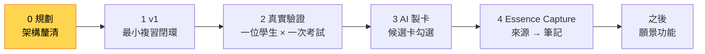

# Essence Cards｜開發現況與路線圖

更新：2026-10-10

## 現在在哪裡

| 項目 | 現況 |
|---|---|
| 階段 | **0. 規劃**：重新釐清架構 |
| 產品程式碼 | 尚未開始 |
| 已驗證 | Obsidian 外掛最小原型可在 Windows／iPhone 執行（2026-10-07） |
| 下一個里程碑 | 完成架構釐清七步，切出 v1 範圍 |

## 路線圖 💡

各階段的內容與先後順序，在架構釐清第 7 步確認。

| 階段 | 內容 | 完成條件 |
|---|---|---|
| 0 規劃 | 架構釐清七步（見下方） | product.md 與 architecture.md 沒有 💬 項目；v1 範圍確定 |
| 1 v1 | 依[產品定義 §5](product.md#5-範圍-第-7-步)選定的最小閉環 | 能在 iPhone 完成一次段考範圍的每日複習 |
| 2 真實驗證 | 一位學生、一次考試 | 依[成功標準](product.md#2-成功標準-第-1-步)記錄結果，決定下一步優先順序 |
| 3 AI 製卡 | AI 從筆記產生候選卡，學生勾選 | 待定 |
| 4 Essence Capture | 另一個 repo | 待定 |
| 之後 | [backlog](backlog.md) 中的願景功能 | — |

## 目前任務：架構釐清七步

一次只談一題，談定後寫進對應文件，並在[決策紀錄](decisions.md)新增條目。

| 步驟 | 主題 | 寫進 | 狀態 |
|---|---|---|---|
| 1 | 成功標準：誰、哪一科、哪次考試、量什麼 | [product §2](product.md#2-成功標準-第-1-步) | ✅ 2026-10-10 |
| 2 | 核心使用情境：主要與次要 | [product §3](product.md#3-使用者與情境-第-2-步) | ✅ 2026-10-10（螺旋式情境的歸類待定） |
| 3 | 產品原則：精簡成 5～7 條 | [product §4](product.md#4-產品原則-第-3-步) | 💬 |
| 4 | 概念模型：v1 實際需要哪些實體 | [architecture §2](architecture.md#2-概念模型-第-4-步) | 💬 |
| 5 | 模組邊界：Cards 與 Capture 的分工和約定 | [architecture §3](architecture.md#3-模組邊界-第-5-步) | 💬 |
| 6 | 資料存放：筆記、卡片、學習紀錄各放哪裡 | [architecture §5](architecture.md#5-資料存放-第-6-步) | 💬 |
| 7 | v1 範圍：要做、之後、不做 | [product §5](product.md#5-範圍-第-7-步) | 💬 |

v1 開發前另外要做的驗證（來自舊任務 T-008）：用真實的 Windows／iPhone 小型 vault，測試離線作答、兩端同時修改、附件與單一檔案救回。

## 已完成

| 日期 | 工作 |
|---|---|
| 2026-10-10 | 架構釐清第 2 步：家長製卡審核、學生複習；英文必備例句與發音；自然材料為課本 PDF 與錯題（[D-019](decisions.md#d-019-使用角色與材料)） |
| 2026-10-10 | 架構釐清第 1 步：成功標準、目標使用者、英文與國二上自然兩個驗證情境（[D-017](decisions.md#d-017-目標使用者)、[D-018](decisions.md#d-018-成功標準與驗證情境)） |
| 2026-10-10 | 北極星寫入文件；文件重整為五份核心文件，v0 規劃與看板封存（[D-014](decisions.md#d-014-文件重整)） |
| 2026-10-09 | 學習目標架構討論：三層模型、複習債務、漸進結構（[紀錄](archive/discussions/2026-10-09-learning-target-architecture-dialogue.md)） |
| 2026-10-07 | 可丟棄原型通過 Windows／iPhone 最小實機驗證 |
| 2026-10-06～07 | v0 規劃：平台、模組、AI 原則、參考軟體研究（見 [archive](archive/README.md)） |
