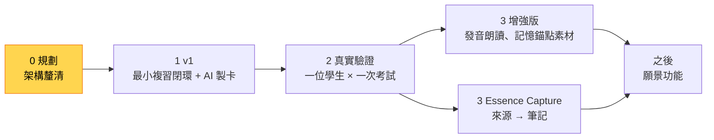

# Essence Cards｜開發現況與路線圖

更新：2026-10-10

## 現在在哪裡

| 項目 | 現況 |
|---|---|
| 階段 | **0. 規劃**：架構釐清七步已完成，接著做 v1 開發前要做的事 |
| 產品程式碼 | 尚未開始 |
| 已驗證 | Obsidian 外掛最小原型可在 Windows／iPhone 執行（2026-10-07） |
| 下一個里程碑 | 完成[v1 開發前要做的事](#v1-開發前要做的事)，開始寫程式 |

## 路線圖

v1 的內容已確認（[D-039](decisions.md#d-039-v1-範圍)）。💡 v1 之後的增強版與 Essence Capture，先後順序依真實驗證的結果決定。

| 階段 | 內容 | 完成條件 |
|---|---|---|
| 0 規劃 | 架構釐清七步（見下方） | product.md 與 architecture.md 沒有 💬 項目；v1 範圍確定 |
| 1 v1 | [產品定義 §5](product.md#5-範圍-第-7-步)的 v1 範圍，包括 AI 製卡（[D-039](decisions.md#d-039-v1-範圍)） | 能在 iPhone 完成一次段考範圍的每日複習 |
| 2 真實驗證 | 一位學生、一次考試 | 依[成功標準](product.md#2-成功標準-第-1-步)記錄結果，決定下一步優先順序 |
| 3 增強版 | 發音朗讀、記憶錨點的素材等；要加強什麼到時候再討論（[backlog](backlog.md#增強版待討論)） | 待定 |
| 3 Essence Capture | 另一個 repo；不提前 | 待定 |
| 之後 | [backlog](backlog.md) 中的願景功能 | — |

## 目前任務：架構釐清七步

一次只談一題，談定後寫進對應文件，並在[決策紀錄](decisions.md)新增條目。

| 步驟 | 主題 | 寫進 | 狀態 |
|---|---|---|---|
| 1 | 成功標準：誰、哪一科、哪次考試、量什麼 | [product §2](product.md#2-成功標準-第-1-步) | ✅ 2026-10-10 |
| 2 | 核心使用情境：主要與次要 | [product §3](product.md#3-使用者與情境-第-2-步) | ✅ 2026-10-10（螺旋式情境的歸類待定） |
| 3 | 產品原則：精簡成 5～7 條 | [product §4](product.md#4-產品原則-第-3-步) | ✅ 2026-10-10 |
| 4 | 概念模型：v1 實際需要哪些實體 | [architecture §2](architecture.md#2-概念模型-第-4-步) | ✅ 2026-10-10 |
| 5 | 模組邊界：Cards 與 Capture 的分工和約定 | [architecture §3](architecture.md#3-模組邊界-第-5-步) | ✅ 2026-10-10（v1 材料來源在第 6 步確認） |
| 6 | 資料存放：教材目錄、學習目標 ID、複習紀錄格式 | [architecture §5](architecture.md#5-資料存放-第-6-步) | ✅ 2026-10-10（出題語法在寫程式前定稿） |
| 7 | v1 範圍：要做、之後、不做 | [product §5](product.md#5-範圍-第-7-步) | ✅ 2026-10-10 |

並行任務：**製卡規則試用** ✅ 第一輪通過（2026-10-10）。規則已更新為 v0.1；之後每做一個新科目或新題型，再用同樣方式試用（[試用方式與紀錄](card-rules/README.md)）。下一個要試用的是「一般知識」預設 v0：用一部影片的筆記試一次（D-038）。

## v1 開發前要做的事

| 事項 | 內容 |
|---|---|
| 出題語法定稿 | 使用者提供舊 Obsidian 閃卡外掛的完整 repo；助理檢視語法，以及其他可以參考的地方，再和使用者做最後確認（[D-030](decisions.md#d-030-出題語法規範)）。定稿後同步更新製卡規則的輸出格式 |
| 成功標準的量測方式 | 記憶保持率與每日複習時間怎麼從複習紀錄計算（[產品定義 §2](product.md#2-成功標準-第-1-步)的 💡 建議） |
| 複習與檢核細節 | 自評段數、佇列組成、中斷與恢復等八個問題（[backlog](backlog.md#複習與檢核細節v1-範圍確定後展開)） |
| 實機驗證（舊 T-008） | 用真實的 Windows／iPhone 小型 vault，測試離線作答、兩端同時修改、附件與單一檔案救回；也要確認 `紀錄/` 裡的 `.jsonl` 檔能正常同步，iPhone 不會因為 iCloud 移除本機檔案而讀不到（[D-035](decisions.md#d-035-複習紀錄格式)） |

## 已完成

| 日期 | 工作 |
|---|---|
| 2026-10-10 | 架構釐清第 7 步：v1 範圍確定，包括 AI 製卡（複製貼上與 API 直連）、在卡組筆記裡審核、不限學業的知識領域；發音朗讀移到增強版；Capture 不提前（D-036～D-039）；新增「一般知識」製卡規則 v0 |
| 2026-10-10 | 架構釐清第 6 步：教材目錄從卡組自動組成、學習目標 ID 用隨機短碼、複習紀錄每台裝置每月一個檔；v1 材料可以是筆記或 PDF；影片不標時間點；出題語法在寫程式前參考舊外掛定稿（D-031～D-035） |
| 2026-10-10 | 架構釐清第 5 步：Capture 是通用知識保存工具，交接約定精簡為四項；需要出題語法規範（D-029、D-030） |
| 2026-10-10 | 架構釐清第 4 步：v1 五種資料、三者分開存放、儲存／範圍／排程分開、跨課題目規則、題目池（D-025～D-028）；製卡規則 v0.2 |
| 2026-10-10 | 架構釐清第 3 步：產品原則精簡為七條；前端介面由 Claude 設計，儀表板列為之後（[D-023](decisions.md#d-023-產品原則)、[D-024](decisions.md#d-024-前端介面設計)） |
| 2026-10-10 | 製卡規則第一輪試用通過：自然有附課本明顯較好；新增題目漸進（[D-021](decisions.md#d-021-教材是製卡依據)、[D-022](decisions.md#d-022-題目漸進)） |
| 2026-10-10 | 製卡規則四層設計（[D-020](decisions.md#d-020-製卡規則分層)）；起草通用、英文、自然三份規則 v0 與試用說明 |
| 2026-10-10 | 架構釐清第 2 步：家長製卡審核、學生複習；英文必備例句與發音；自然材料為課本 PDF 與錯題（[D-019](decisions.md#d-019-使用角色與材料)） |
| 2026-10-10 | 架構釐清第 1 步：成功標準、目標使用者、英文與國二上自然兩個驗證情境（[D-017](decisions.md#d-017-目標使用者)、[D-018](decisions.md#d-018-成功標準與驗證情境)） |
| 2026-10-10 | 北極星寫入文件；文件重整為五份核心文件，v0 規劃與看板封存（[D-014](decisions.md#d-014-文件重整)） |
| 2026-10-09 | 學習目標架構討論：三層模型、複習債務、漸進結構（[紀錄](archive/discussions/2026-10-09-learning-target-architecture-dialogue.md)） |
| 2026-10-07 | 可丟棄原型通過 Windows／iPhone 最小實機驗證 |
| 2026-10-06～07 | v0 規劃：平台、模組、AI 原則、參考軟體研究（見 [archive](archive/README.md)） |
