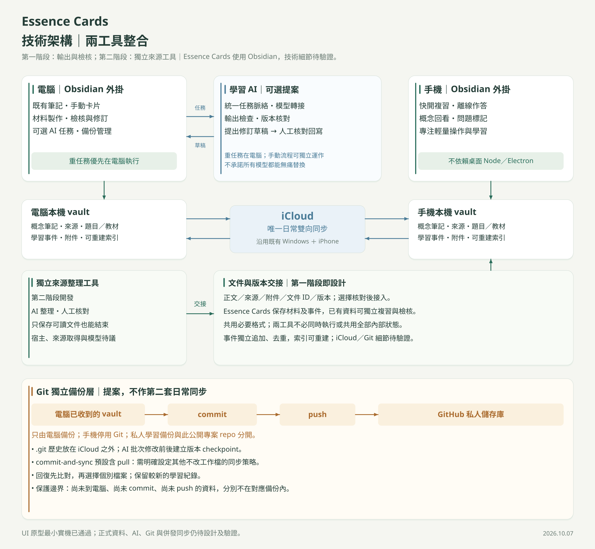
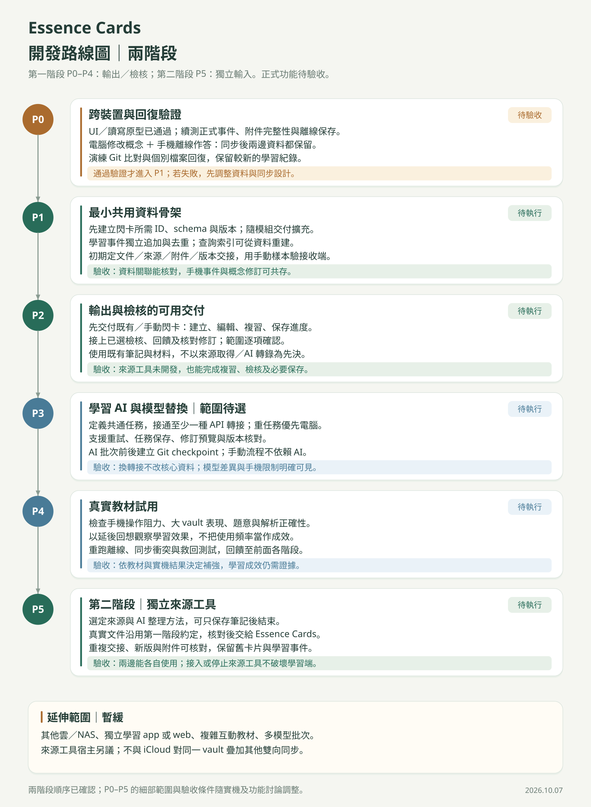

# Essence Cards｜技術架構與開發路線圖

更新日期：2026-10-07（Asia/Taipei）｜設計版 v1.3

本文件整理平台、裝置、資料、AI、同步及版本回復的設計方向。它是規劃文件；已建立可丟棄的 UI／讀寫原型，尚未實作正式學習工具，也沒有工期承諾。產品學習循環見[學習藍圖](learning-blueprint.md)；視覺圖與第一版驗證門檻見下方。

## 技術架構

| 狀態 | 方向 |
|---|---|
| 已確認 | 第一版採 Obsidian 外掛；多情境介面共用概念筆記，不重新打造整套筆記軟體 |
| 已確認 | 電腦負責輸入、整理與筆記管理；iPhone 聚焦隨手複習，仍須記錄學習事件 |
| 第一版驗證基線 | 沿用使用者既有 Windows／iPhone 的 iCloud 同步，不額外疊加 Dropbox／Remotely Save |
| 設計提案，待驗證 | Markdown 知識資料、穩定 ID、內容版本、獨立追加的學習事件、可重建索引 |
| 設計提案，待驗證 | 共通 AI 任務介面、模型轉接層、修訂草稿、來源與版本核對 |
| 設計提案，待驗證 | Git 只在電腦記錄歷史；推送到獨立的 GitHub 私人儲存庫備份 |
| 保留彈性，非第一版承諾 | 其他雲端同步、本機或 NAS 選配；獨立手機 App／網頁 |

使用者偏好免費、不需每月訂閱的方案。AI API、雲端容量與服務額度另行評估，不承諾所有模型或使用量都免費。

## 三模組與逐步整合

依 C-020，產品以 M-001 輸入、M-002 輸出、M-003 檢核為三個主要模組，在同一個 Obsidian 外掛內分開開發；共用資料、識別、事件及可選 AI 是支援基礎，不另列第四大模組。詳細責任與交接規格見[三模組架構](module-architecture.md)。

M-001 可只將 YouTube 等來源整理為可讀筆記，M-002 可只使用既有／手動卡片複習。模組間交接可選，每完成一個可用單位就接入工具；新增輸入或檢核不能破壞原有獨立模式。基本翻卡、自評與必要複習規則不依賴完整檢核工作區。

先確定最小可用閃卡與其必要共用核心，再逐步加入輸入及檢核；不先建立所有共用能力才開始交付。YouTube → 筆記是已確認的獨立使用情境，取得文字、轉錄及模型方法尚未選定，也未指定為第一個匯入格式。獨立使用仍須保留來源核對、資料保存與版本保護。

## 裝置與資料分工

- 電腦：帶入來源、編輯概念筆記、整理關聯、製作教材、執行較重的 AI 任務、確認修訂及管理備份。
- iPhone：快速開始或接續複習、作答、查看解析與概念、標記內容疑問；以已準備內容完成一般複習，不要求電腦持續開機。
- 兩端讀取各自本機 vault；iCloud 同步檔案。這是共用的邏輯資料來源，並非兩端直接連線同一個雲端 SQL 資料庫。
- 概念、來源、題目、卡片及教材使用穩定 ID 與版本關聯；作答保留當時題目／內容版本，不能因筆記更新而改寫舊作答的意義。
- 手機學習事件以獨立、不可變事件檔追加，附事件 ID、裝置與版本；設計去重機制，避免不同裝置競爭覆寫同一份累計檔。檔案格式、數量與壓縮策略待 P1 驗證。
- 索引與彙總狀態由內容及事件重建，不把 SQLite 等本機快取檔當成跨裝置同步的唯一資料來源。
- 筆記修訂以電腦為主要入口；手機先標記疑問。AI 寫入前再次核對來源版本，遇到新版則重新比對，不能以舊草稿覆蓋新內容。

以上是降低衝突的設計提案，不是對 iCloud 無衝突的保證。附件亦需納入可用性與救回驗證，不能只測 Markdown 文字。

## AI 可替換與接管設計

不同模型透過轉接層讀取統一的任務資料：目的、概念與來源 ID、內容版本、必要脈絡、已確認結果、待處理修訂及任務狀態。模型輸出修訂對象、依據、理由、建議變更及不確定處。

系統負責檢查格式、引用對象與版本，再呈現可核對草稿；格式正確不代表知識內容正確。任務狀態保存在系統資料，不只放在某一供應商的聊天紀錄，方便重試、切換模型與交接。

手機共用邏輯不得依賴桌面 Node.js／Electron；長時間或重運算任務以電腦為主。首批模型及能力逐一驗證，不承諾所有語言模型都能零修改接管，也不把手機背景持續執行作為一般複習的必要條件。

## Git 備份與版本回復的設計重點

**iCloud 負責裝置同步；Git 負責歷史；GitHub 私人儲存庫保存已推送的版本。Git 有助於降低失誤損失，不會修復 iCloud 的同步機制。以下需保留為後續實作與驗收依據。**

| 重點 | 設計要求與保護邊界 |
|---|---|
| 單一日常同步 | 同一 vault 只讓 iCloud 負責日常跨裝置同步；Git 不作第二套雙向檔案同步 |
| 僅電腦執行 | 手機停用 Git 外掛；若設定隨 iCloud 複製，可用外掛的「Disable on this device」 |
| 歷史資料位置 | 將實際 `.git` 歷史目錄放在 iCloud vault 之外；vault 可留 `gitdir:` 指向檔。路徑因裝置而異，手機不使用此指向 |
| 忽略規則邊界 | `.gitignore` 只控制 Git 追蹤，不能阻止 iCloud 同步 `.git`；排除金鑰、敏感設定與可重建快取 |
| 明確的操作策略 | 一般備份以 commit／push 為主。預設 commit-and-sync 包含 pull，需關閉一般覆寫工作檔的拉取，或驗證「Other sync service」策略後使用；不得把自動 pull／checkout 當成日常同步 |
| 修改檢查點 | AI 批次修改、匯入、schema 遷移或大量重命名前後保存版本；動作前確認本機資料可讀。自動頻率、失敗提醒與離線重試另行設計 |
| 回復方式 | 先在隔離位置查看舊版本及差異，選擇個別檔案／內容救回；保留較新的學習事件，再建立新版本並由 iCloud 傳遞 |
| 版本覆蓋範圍 | 未同步到電腦的手機資料不在電腦 Git 保護範圍；未 commit 的內容無 Git 歷史；未 push 的版本沒有 GitHub 異地副本 |
| 附件與完整性 | 原文、圖片與必要附件不能默默漏出備份；大附件、容量、連結有效性與是否另存，須另訂策略並實測回復 |
| 公私分離 | 此公開 Essence-Cards repo 只放程式與設計文件；個人筆記的私人備份儲存庫另建，不上傳私人學習資料或 API 金鑰到公開 repo |

此工作只保存 Git 設計，沒有安裝 Git 外掛、建立個人備份儲存庫或變更使用者 iCloud。

## 開發路線圖

以下是助理建議的開發順序，功能範圍與驗收尺度待確認。依 C-018，[自訂 UI 與基本讀寫原型](obsidian-ui-probe.md)已於 2026-10-07 依使用者回報通過 Windows／iPhone 最小實機驗收，恢復功能討論；原型架構可完全推翻。完整 P0 的正式學習事件、併發、附件完整性及 Git 回復仍待驗證，其結果決定目前同步方案能否支援正式功能；遇到資料保存或同步問題時，先解決再展開完整功能開發。

| 階段 | 交付方向 | 進入下一階段的條件 |
|---|---|---|
| P0 可行性驗證 | 真實 Windows＋iPhone 的小型測試 vault、離線事件及 Git 回復試驗 | 筆記與附件可讀；離線作答關閉重開後保留；電腦修訂與手機作答同步後兩者都在；可救回單一受損檔且不丟新事件 |
| P1 最小共用資料骨架 | 首批閃卡所需 ID、schema／遷移、版本關聯、學習事件及可重建索引，逐步擴充 | 事件重送不重複計算；舊作答能連回當時內容；索引可重建；後續模組能補上關聯 |
| P2 可獨立使用的模組交付 | 先以既有／手動卡片建立、編輯、複習及保存進度；再增量加入輸入與可選檢核，串接學習循環 | 閃卡可獨立用；加入模組後原模式與紀錄保留；每次交付同時驗新能力與既有獨立入口 |
| P3 AI 任務與可替換模型 | 共通任務、至少一種 API 轉接、任務保存／重試、草稿預覽、版本核對及 Git 檢查點 | 錯誤輸出可處理；過期草稿不覆寫新版；替換符合介面的模型可驗證；基本手動流程可獨立使用 |
| P4 真實教材試用 | 手機操作、接近實際規模的 vault、內容正確性、延後回想及同步／救回演練 | 依明確使用情境檢查阻力、效能與學習表現；記錄結果後決定深化優先順序 |

後續候選：更複雜來源匯入、互動教材、錯因診斷與復盤、多模型批次任務、其他同步服務、NAS、自製 App／網頁。這些不屬於本次第一版交付承諾。

## 風險與轉向條件

- Windows iCloud 已被 Obsidian 官方指出可能造成檔案重複或損壞；使用者現有同步可用，仍不足以證明外掛自動寫入、離線及併發情境可用。
- Git 可救回已留存版本，但無法保證手機尚未傳出的資料安全。若 P0 反覆丟事件、無法穩定取得附件或無法可靠回復，需重新評估同步方案。
- 改同步服務時採有計畫的遷移與驗證，不能把 Dropbox、Remotely Save 或另一服務直接疊加在同一 iCloud vault 上。
- 無訂閱優先不等於任何雲端、模型或大量附件都永久免費；額度與執行成本在選定首批能力時確認。

## 查核來源與文件索引

2026-10-06 查核官方文件。產品設計與路線圖是本專案提案；下面是技術限制及外掛行為的來源，並非本產品已通過驗證的證據。

- [Obsidian 裝置同步](https://obsidian.md/help/sync-notes)：本機 vault、Windows iCloud 風險及避免混用同步服務。
- [Obsidian 手機外掛開發](https://docs.obsidian.md/Plugins/Getting%20started/Mobile%20development)：手機不支援桌面 Node.js／Electron 功能。
- [Obsidian Git](https://github.com/Vinzent03/obsidian-git)：版本歷史、commit／push／pull 與預設 commit-and-sync 行為。
- [Git Getting Started](https://publish.obsidian.md/git-doc/Getting%20Started)：iCloud 與 `.git` 外部位置、手機 Git 不穩定。
- [Git Tips and Tricks](https://publish.obsidian.md/git-doc/Tips-and-Tricks)：單裝置停用、忽略規則、其他同步服務的拉取策略。
- [共識](consensus.md)、[目前任務](tasks.md)、[本次討論摘要](discussions/2026-10-06-technical-roadmap.md)。
